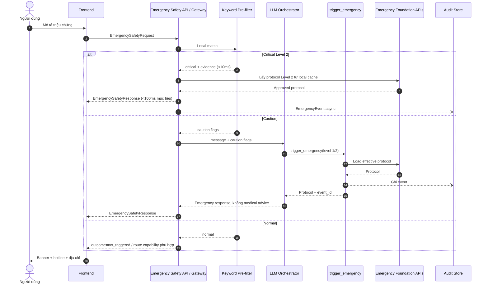
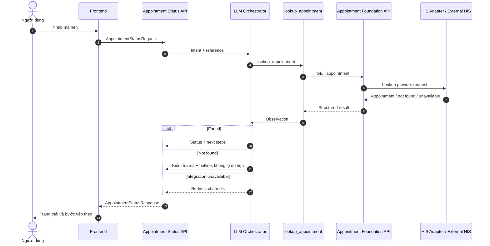
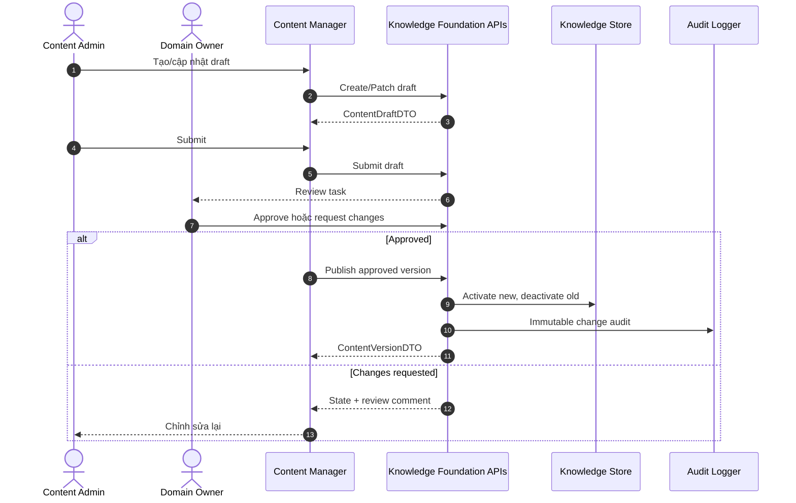

# Thiết kế Hợp đồng Giao diện — Trợ lý Thông tin Bệnh viện AI

**Phiên bản:** 1.0  
**Trạng thái:** Implementation-ready  
**Phạm vi nguồn:** `1.requirement-analysis.md`, `2.product-definition.md`, `3.architecture-design.md`  
**Nguyên tắc:** Capability-first; độc lập công nghệ triển khai; Foundation API không suy luận AI.

## Phạm vi và thuật ngữ

- **Capability sản phẩm** là kết quả nghiệp vụ độc lập mà người dùng cần hoàn thành. Mỗi capability có đúng một Capability API chính.
- **AI capability (`CAP-*`)** là năng lực cấu thành do Product Definition định nghĩa; nhiều AI capability có thể phối hợp trong một capability sản phẩm.
- **Capability API** điều phối suy luận, ngữ cảnh và tool; là giao diện chính cho Chat Widget/Standalone Chat Page.
- **Foundation API** chỉ đọc/ghi dữ liệu hoặc thực hiện thao tác xác định trước, nhanh, rẻ, không suy luận.
- API HIS thật là **conditional**. Hợp đồng không phụ thuộc Mock HIS hay một CRM/HIS cụ thể; adapter chịu trách nhiệm chuyển đổi.
- Nội dung y tế, emergency, BHYT, giá và quy trình chỉ được trả từ nguồn đã phê duyệt. Không có nguồn đủ tin cậy thì fallback, không suy đoán.

---

# Artifact 0 — Capability Traceability Matrix

## 0.1 Danh mục định danh

| Mã | Capability sản phẩm | AI capability cấu thành | Capability API chính |
|---|---|---|---|
| PC-01 | Hỗ trợ thông tin bệnh viện có căn cứ | CAP-1, CAP-2, CAP-5, CAP-6 và CAP-4 khi cần bước tiếp theo | `POST /v1/capabilities/information-assistance:execute` |
| PC-02 | Bảo vệ an toàn trong tình huống khẩn cấp | CAP-3; Keyword Pre-filter là safety net không-AI | `POST /v1/capabilities/emergency-safety:execute` |
| PC-03 | Hỗ trợ đặt lịch khám | CAP-1, CAP-4, CAP-5; CAP-2 áp dụng cho phần thông tin | `POST /v1/capabilities/appointment-booking:execute` |
| PC-04 | Hỗ trợ tra cứu lịch hẹn | CAP-1, CAP-4; CAP-2 áp dụng cho hướng dẫn bổ sung | `POST /v1/capabilities/appointment-status:execute` |

## 0.2 Ma trận truy vết đầy đủ

| Business Goal | JTBD | Business Flow | Capability | Capability API | Tool | Foundation API | Component | Acceptance Criteria |
|---|---|---|---|---|---|---|---|---|
| SBG-01, SBG-02, SBG-03 | JTBD-01 Chuẩn bị khám/tái khám | BF-1 Tra cứu & Phục vụ | PC-01 | Information Assistance | `search_knowledge_base`, `fallback_response` | Knowledge Search, Session, Configuration | Chat Gateway, LLM Orchestrator, RAG Engine, Guardrail | AC-P01, AC-P02, AC-P06, AC-P07, AC-B01, AC-B02, AC-T01, AC-T02, AC-PR02 |
| SBG-01, SBG-03 | JTBD-02 Biết đúng kênh đặt lịch | BF-1; BF-3 Đặt lịch theo Architecture | PC-03 | Appointment Booking | `get_specialty_list`, `get_doctor_list`, `get_available_slots`, `create_appointment`, `fallback_response` | Specialty, Doctor, Slot, Appointment Command, Channel Config | LLM Orchestrator, Appointment Service, HIS Adapter | AC-P05, AC-T01, AC-T02, AC-T03 |
| SBG-01, SBG-03 | JTBD-03 Xác nhận lịch hẹn | BF-4 Tra cứu lịch | PC-04 | Appointment Status | `lookup_appointment`, `fallback_response`, `search_knowledge_base` | Appointment Lookup, Knowledge Search, Channel Config | LLM Orchestrator, Appointment Service, HIS Adapter, RAG Engine | AC-P05, AC-P07, AC-T01, AC-T03 |
| SBG-01, SBG-02 | JTBD-04 Hiểu quy trình | BF-1; BF-5 Quality Loop hỗ trợ | PC-01 | Information Assistance | `search_knowledge_base`, `fallback_response` | Knowledge Search, Session | LLM Orchestrator, RAG Engine, Guardrail, Content Manager | AC-P01, AC-P02, AC-P06, AC-P07, AC-B01, AC-B02, AC-B04 |
| SBG-01, SBG-02, SBG-04 | JTBD-05 BHYT và giá | BF-1; BF-5 Quality Loop | PC-01 | Information Assistance | `search_knowledge_base`, `fallback_response` | Knowledge Search, Session | LLM Orchestrator, RAG Engine, Guardrail, Content Manager | AC-P01, AC-P02, AC-B01, AC-B02, AC-B04, AC-B06 |
| SBG-01, SBG-03 | JTBD-06 Tìm bác sĩ/khoa | BF-1 | PC-01 | Information Assistance | `search_knowledge_base`; có thể `get_specialty_list`, `get_doctor_list` khi dữ liệu động sẵn sàng | Knowledge Search, Specialty, Doctor | LLM Orchestrator, RAG Engine, Appointment Service, HIS Adapter | AC-P01, AC-P06, AC-T02 |
| SBG-04 | JTBD-07 Hướng dẫn an toàn | BF-2 Emergency | PC-02 | Emergency Safety | `trigger_emergency`; critical path dùng Protocol Loader trực tiếp | Emergency Protocol, Emergency Audit | Keyword Pre-filter, Emergency Protocol Loader, LLM Orchestrator, Audit Logger | AC-P03, AC-P04, AC-B03, AC-T01, AC-T02, AC-T03 |
| SBG-01, SBG-03 | JTBD-08 Bước tiếp theo sau khám | BF-1; BF-4 nếu có mã hẹn | PC-01 hoặc PC-04 theo intent | Information Assistance hoặc Appointment Status | `search_knowledge_base`, `lookup_appointment`, `fallback_response` | Knowledge Search, Appointment Lookup | LLM Orchestrator, RAG Engine, Appointment Service | AC-P01, AC-P05, AC-P07 |
| SBG-04 | Tất cả JTBD | Tất cả flow | PC-01 đến PC-04 | Tất cả Capability API | `detect_pii`, `log_conversation`; Guardrail không phơi như tool | Session, Feedback, Audit/History, Configuration | Chat/Standalone Frontend, Chat Gateway, Guardrail, Conversation Logger, Audit Logger | AC-P04, AC-B05, AC-B06, AC-T03, AC-T04, AC-T05, AC-PR01, AC-PR03, AC-PR04 |
| OG-04 Insight | Hỗ trợ tất cả JTBD | BF-5 Quality Loop | Chức năng nền, không phải AI capability | Không có Capability API | `detect_pii`, `log_conversation` | Analytics Summary, Feedback | Conversation Logger, Analytics Store | AC-B05, AC-T03 |

**Kết luận truy vết:** mọi capability hướng người dùng đều bắt đầu từ business goal và JTBD; các chức năng vận hành không suy luận được đặt ở Foundation layer, không giả mạo thành AI capability.

---

# Artifact 1 — Capability Model

## PC-01 — Hỗ trợ thông tin bệnh viện có căn cứ

| Thuộc tính | Nội dung |
|---|---|
| Mô tả | Hiểu câu hỏi tiếng Việt tự nhiên, truy xuất nguồn chính thức, tổng hợp đa domain, diễn đạt dễ hiểu, trích dẫn và hướng dẫn bước tiếp theo. |
| Business Value | Tăng containment, chuẩn hóa thông tin, giảm tải hotline, phục vụ 24/7. |
| AI Value | CAP-1 hiểu intent; CAP-2 chống hallucination; CAP-5 tổng hợp; CAP-6 đơn giản hóa; CAP-4 điều hướng khi cần. |
| Primary Persona | P1 bệnh nhân đang điều trị; P2 người chăm sóc; P3 bệnh nhân mới. |
| JTBD Mapping | JTBD-01, JTBD-04, JTBD-05, JTBD-06, JTBD-08; hỗ trợ phần thông tin của JTBD-02/03. |
| Business Flow Mapping | BF-1; phụ thuộc chất lượng từ BF-5. |
| Dependencies | Session context, RAG/Knowledge, LLM abstraction, guardrail, channel configuration, logging. |
| Success Criteria | 7 domain được hỗ trợ; 100% câu trả lời quan trọng có nguồn; fallback đúng chuẩn khi thiếu nguồn; multi-turn đúng; TTFT ≤ 2 giây và phản hồi đầy đủ ≤ 5 giây trong điều kiện bình thường. |

## PC-02 — Bảo vệ an toàn trong tình huống khẩn cấp

| Thuộc tính | Nội dung |
|---|---|
| Mô tả | Phát hiện dấu hiệu critical/possible concern, ngắt luồng phù hợp và trả protocol đã được y tế phê duyệt; không tư vấn điều trị. |
| Business Value | Giảm nguy cơ chậm trễ, bảo vệ người dùng và tuân thủ an toàn bệnh viện. |
| AI Value | CAP-3 đánh giá mô tả gián tiếp/caution; Keyword Pre-filter bảo vệ critical path khi LLM hoặc network lỗi. |
| Primary Persona | P1, P2. |
| JTBD Mapping | JTBD-07. |
| Business Flow Mapping | BF-2 Emergency. |
| Dependencies | Keyword set và protocol đã phê duyệt, Emergency Protocol Loader, LLM Orchestrator cho caution path, Audit Logger. |
| Success Criteria | Recall ≥ 99%; critical response < 100ms theo architecture goal và luôn ≤ 1 giây theo requirement; không lời khuyên điều trị; mọi trigger có audit. |

## PC-03 — Hỗ trợ đặt lịch khám

| Thuộc tính | Nội dung |
|---|---|
| Mô tả | Thu thập theo từng bước, lấy chuyên khoa/bác sĩ/lịch trống, xác nhận rõ ràng rồi tạo lịch ở trạng thái `pending`; khi tích hợp không sẵn sàng thì redirect đúng kênh. |
| Business Value | Giảm chờ hotline, tăng hoàn tất hành động, giảm đặt sai khoa. |
| AI Value | CAP-1 hiểu intent và dữ liệu hội thoại; CAP-5 quản lý thu thập đa lượt; CAP-4 chọn và thực thi hành động. |
| Primary Persona | P1, P2, P3. |
| JTBD Mapping | JTBD-02; hỗ trợ JTBD-01 và JTBD-08. |
| Business Flow Mapping | BF-3 Đặt lịch theo Solution Architecture; liên quan BF-1 trong Product Definition. |
| Dependencies | Appointment Service, HIS Adapter, specialty/doctor/slot foundation APIs, explicit confirmation, session state. |
| Success Criteria | Không tạo lịch trước xác nhận; trả mã hẹn và `pending`; fallback/redirect khi HIS không sẵn sàng; không suy luận chuyên môn để chọn bác sĩ. |

## PC-04 — Hỗ trợ tra cứu lịch hẹn

| Thuộc tính | Nội dung |
|---|---|
| Mô tả | Thu nhận mã hẹn tối thiểu, tra cứu trạng thái và giải thích bước tiếp theo theo trạng thái. |
| Business Value | Giảm cuộc gọi xác nhận lịch và giúp bệnh nhân chủ động. |
| AI Value | CAP-1 nhận diện yêu cầu; CAP-4 gọi đúng tool và trình bày next action; CAP-2 chỉ dùng nguồn chính thức cho hướng dẫn bổ sung. |
| Primary Persona | P1, P2. |
| JTBD Mapping | JTBD-03; hỗ trợ JTBD-08. |
| Business Flow Mapping | BF-4 Tra cứu lịch. |
| Dependencies | Appointment Service/HIS Adapter conditional, Knowledge Search cho checklist, channel fallback. |
| Success Criteria | Trả đúng `pending/confirmed/cancelled/rejected/completed/not_found`; tối giản định danh; hướng dẫn rõ khi không tìm thấy hoặc integration lỗi. |

---

# Artifact 2 — AI Capability API Design

## 2.1 Quy ước chung

- Base path: `/v1/capabilities`.
- Tất cả request có `request_id`; response có `trace_id`, `capability`, `outcome`, `result`, `explainability`, `errors`.
- `POST` được dùng vì mỗi API thực thi capability có ngữ cảnh, không biểu diễn CRUD resource.
- `response_mode=stream` sử dụng SSE; event contract: `ack`, `status`, `content_delta`, `tool_status`, `citation`, `action`, `completed`, `error`.
- Critical emergency có thể hoàn tất ngay tại Gateway nhưng vẫn tuân cùng response DTO của PC-02.

## 2.2 PC-01 Information Assistance API

| Thuộc tính | Nội dung |
|---|---|
| Phân loại | Chat / Customer Insight |
| Purpose | Trả lời thông tin chính thức, đa lượt, có căn cứ và next action. |
| Endpoint / Method | `POST /v1/capabilities/information-assistance:execute` |
| Request DTO | `InformationAssistanceRequest` |
| Response DTO | `InformationAssistanceResponse` |
| Capability | PC-01 |
| Business Goal | SBG-01, SBG-02, SBG-03; guardrail SBG-04 |
| AI Capability | CAP-1, CAP-2, CAP-5, CAP-6, tùy chọn CAP-4 |
| Dependencies | Session, RAG, LLM provider chain, Guardrail, Foundation Knowledge/Config APIs |

Ví dụ request:

```json
{
  "request_id": "req-01",
  "session_id": "ses-01",
  "message": "Khám lần đầu có BHYT cần mang gì?",
  "response_mode": "complete",
  "client_context": {"channel": "web_widget", "locale": "vi-VN"}
}
```

Ví dụ response rút gọn:

```json
{
  "trace_id": "trc-01",
  "capability": "PC-01",
  "outcome": "answered",
  "result": {
    "message": "...",
    "citations": [{"source_title": "...", "section": "...", "effective_date": "2026-01-01"}],
    "suggested_actions": [{"type": "open_channel", "label": "Đặt lịch", "target_ref": "booking-online"}]
  },
  "explainability": {"grounded": true, "fallback_reason": null}
}
```

## 2.3 PC-02 Emergency Safety API

| Thuộc tính | Nội dung |
|---|---|
| Phân loại | Others — Safety |
| Purpose | Đánh giá safety path và trả protocol phê duyệt, không chẩn đoán. |
| Endpoint / Method | `POST /v1/capabilities/emergency-safety:execute` |
| Request DTO | `EmergencySafetyRequest` |
| Response DTO | `EmergencySafetyResponse` |
| Capability | PC-02 |
| Business Goal | SBG-04 |
| AI Capability | CAP-3; Keyword Pre-filter không-AI |
| Dependencies | Emergency Keyword/Protocol Foundation APIs, Audit; LLM chỉ ở caution path |

```json
{
  "request_id": "req-02",
  "session_id": "ses-01",
  "message": "bố tôi đau ngực dữ dội và khó thở",
  "prefilter": {"result": "critical", "matched_evidence": ["đau ngực dữ dội", "khó thở"]}
}
```

```json
{
  "trace_id": "trc-02",
  "capability": "PC-02",
  "outcome": "emergency_triggered",
  "result": {
    "level": 2,
    "detection_path": "keyword",
    "response_text": "...nội dung protocol đã phê duyệt...",
    "hotlines": ["115"],
    "emergency_address": "...",
    "banner_level": 2,
    "event_id": "evt-01"
  },
  "explainability": {"matched_evidence": ["đau ngực dữ dội", "khó thở"], "clinical_assessment": null}
}
```

## 2.4 PC-03 Appointment Booking API

| Thuộc tính | Nội dung |
|---|---|
| Phân loại | Planning / Recommendation / Others—Transaction |
| Purpose | Điều phối một bước của luồng đặt lịch đa lượt; chỉ tạo sau xác nhận rõ ràng. |
| Endpoint / Method | `POST /v1/capabilities/appointment-booking:execute` |
| Request DTO | `AppointmentBookingRequest` |
| Response DTO | `AppointmentBookingResponse` |
| Capability | PC-03 |
| Business Goal | SBG-01, SBG-03, OG-03, PG-04 |
| AI Capability | CAP-1, CAP-4, CAP-5; CAP-2 cho thông tin kèm theo |
| Dependencies | Session/BusinessContext; Specialty, Doctor, Slot, Appointment Foundation APIs; HIS Adapter conditional |

```json
{
  "request_id": "req-03",
  "session_id": "ses-02",
  "message": "Tôi xác nhận đặt lịch",
  "flow_state": {"flow_id": "flw-01", "step": "confirmation", "collected_fields": ["visit_type", "specialty_id", "doctor_id", "slot_id", "patient_data"]},
  "confirmation": {"confirmed": true, "confirmation_token": "cft-01"}
}
```

```json
{
  "trace_id": "trc-03",
  "capability": "PC-03",
  "outcome": "appointment_pending",
  "result": {"appointment_id": "HEN-2026-0342", "status": "pending", "next_step": "Chờ bệnh viện xác nhận"},
  "flow_state": {"flow_id": "flw-01", "step": "completed", "missing_fields": []}
}
```

## 2.5 PC-04 Appointment Status API

| Thuộc tính | Nội dung |
|---|---|
| Phân loại | Chat / Others—Lookup orchestration |
| Purpose | Tra cứu lịch bằng định danh tối thiểu và tạo hướng dẫn theo trạng thái. |
| Endpoint / Method | `POST /v1/capabilities/appointment-status:execute` |
| Request DTO | `AppointmentStatusRequest` |
| Response DTO | `AppointmentStatusResponse` |
| Capability | PC-04 |
| Business Goal | SBG-01, SBG-03 |
| AI Capability | CAP-1, CAP-4, CAP-2 cho hướng dẫn căn cứ |
| Dependencies | Appointment Lookup, Knowledge Search, Channel Config |

```json
{
  "request_id": "req-04",
  "session_id": "ses-03",
  "appointment_reference": {"appointment_id": "HEN-2026-0342"}
}
```

```json
{
  "trace_id": "trc-04",
  "capability": "PC-04",
  "outcome": "found",
  "result": {"appointment_id": "HEN-2026-0342", "status": "confirmed", "doctor_display_name": "...", "date": "2026-07-20", "time": "08:00", "next_steps": ["Đến trước 15 phút"]}
}
```

---

# Artifact 3 — Foundation API Design

Foundation API không gọi LLM, không lựa chọn nghiệp vụ bằng suy luận và không tổng hợp câu trả lời tự nhiên.

| ID | Purpose | Endpoint / Method | Request | Response | Consumers |
|---|---|---|---|---|---|
| FND-SES-01 | Tạo session | `POST /v1/foundation/sessions` | `SessionCreateRequest` | `SessionDTO` | Chat Widget, Standalone Page |
| FND-SES-02 | Lấy context trong phiên | `GET /v1/foundation/sessions/{session_id}` | Path `session_id` | `SessionContextDTO` | Capability APIs |
| FND-SES-03 | Cập nhật state xác định trước | `PATCH /v1/foundation/sessions/{session_id}/context` | `SessionContextPatchRequest` | `SessionContextDTO` | Capability APIs |
| FND-KNW-01 | Tìm chunks đã duyệt | `POST /v1/foundation/knowledge:search` | `KnowledgeSearchRequest` | `KnowledgeSearchResponse` | PC-01, PC-03, PC-04; RAG Engine |
| FND-KNW-02 | Lấy citation/chunk theo ID | `GET /v1/foundation/knowledge/chunks/{chunk_id}` | Path `chunk_id` | `KnowledgeChunkDTO` | Capability APIs, audit |
| FND-KNW-03 | Tạo bản nháp nội dung | `POST /v1/foundation/knowledge/drafts` | `ContentDraftCreateRequest` | `ContentDraftDTO` | Content Manager |
| FND-KNW-04 | Cập nhật bản nháp | `PATCH /v1/foundation/knowledge/drafts/{draft_id}` | `ContentDraftPatchRequest` | `ContentDraftDTO` | Content Admin |
| FND-KNW-05 | Gửi phê duyệt | `POST /v1/foundation/knowledge/drafts/{draft_id}:submit` | `ContentSubmitRequest` | `ContentApprovalStateDTO` | Content Admin |
| FND-KNW-06 | Phê duyệt/từ chối | `POST /v1/foundation/knowledge/drafts/{draft_id}:review` | `ContentReviewRequest` | `ContentApprovalStateDTO` | Domain Owner |
| FND-KNW-07 | Xuất bản phiên bản đã duyệt | `POST /v1/foundation/knowledge/drafts/{draft_id}:publish` | `ContentPublishRequest` | `ContentVersionDTO` | Content Manager |
| FND-KNW-08 | Liệt kê content conflicts cho dashboard | `GET /v1/foundation/knowledge/conflicts` | `status`, `domain_code`, `due_before`, pagination | `ContentConflictPageDTO` | Content/Operations Admin |
| FND-KNW-09 | Resolve content conflict | `POST /v1/foundation/knowledge/conflicts/{conflict_id}:resolve` | `ContentConflictResolveRequest` + idempotency key | `ContentConflictDTO` | Domain Owner |
| FND-EMG-01 | Lấy protocol có hiệu lực | `GET /v1/foundation/emergency/protocols/{level}` | `level=1|2`, `at` tùy chọn | `EmergencyProtocolDTO` | PC-02, Protocol Loader |
| FND-EMG-02 | Lấy keyword set có hiệu lực | `GET /v1/foundation/emergency/keyword-set` | `at` tùy chọn | `EmergencyKeywordSetDTO` | Chat Gateway |
| FND-EMG-03 | Ghi emergency audit | `POST /v1/foundation/emergency/events` | `EmergencyEventCreateRequest` | `EmergencyEventReceiptDTO` | PC-02, Audit Logger |
| FND-APT-01 | Danh sách chuyên khoa active | `GET /v1/foundation/specialties` | `active`, pagination | `SpecialtyPageDTO` | PC-03, PC-01 |
| FND-APT-02 | Danh sách bác sĩ | `GET /v1/foundation/doctors` | `specialty_id`, `active`, pagination | `DoctorPageDTO` | PC-03, PC-01 |
| FND-APT-03 | Lịch trống | `GET /v1/foundation/doctors/{doctor_id}/available-slots` | `date_from`, `date_to` | `AvailableSlotPageDTO` | PC-03 |
| FND-APT-04 | Tạo lịch chờ duyệt | `POST /v1/foundation/appointments` | `AppointmentCreateRequest` + idempotency key | `AppointmentDTO` | PC-03 |
| FND-APT-05 | Tra lịch theo mã | `GET /v1/foundation/appointments/{appointment_id}` | Path `appointment_id` | `AppointmentDTO` | PC-04 |
| FND-CFG-01 | Lấy kênh hành động/hotline | `GET /v1/foundation/configuration/channels` | `channel_type`, `at` | `ChannelConfigurationDTO` | PC-01 đến PC-04, Frontend |
| FND-CFG-02 | Lấy quick prompts và disclaimer | `GET /v1/foundation/configuration/chat` | `locale`, `channel` | `ChatConfigurationDTO` | Frontend |
| FND-FBK-01 | Ghi phản hồi hữu ích | `POST /v1/foundation/feedback` | `FeedbackCreateRequest` | `FeedbackReceiptDTO` | Frontend |
| FND-HIS-01 | Lấy lịch sử hội thoại đã ẩn danh | `GET /v1/foundation/conversation-history` | time range, session, pagination | `ConversationHistoryPageDTO` | Người được RBAC cho phép |
| FND-ANA-01 | Số liệu cơ bản | `GET /v1/foundation/analytics/summary` | time range, dimensions | `AnalyticsSummaryDTO` | Content/Operations Admin |

### Quy tắc đặc biệt

- Foundation appointment APIs trả `503 INTEGRATION_UNAVAILABLE` khi HIS chưa sẵn sàng; Capability API chuyển sang channel redirect có cấu hình.
- Raw patient data chỉ đi tới Appointment Service/HIS boundary; conversation/analytics chỉ nhận bản đã ẩn danh.
- Publish chỉ thành công với bản nháp `approved`, đúng approver theo domain, ngày hiệu lực hợp lệ; nội dung cũ được vô hiệu hóa và lưu version history.
- Content conflict được cảnh báo trên dashboard, có SLA 24 giờ và audit; MVP không gửi Email/Teams/CRM.
- Emergency Protocol/Keyword APIs chỉ trả phiên bản đã được bác sĩ có thẩm quyền phê duyệt.

---

# Artifact 4 — Data Contract

## 4.1 Quy tắc mô tả trường

- Trường không ghi “tùy chọn” là bắt buộc.
- Thời điểm dùng ISO 8601 có múi giờ; ngày dùng `YYYY-MM-DD`; mã định danh là opaque string, không để consumer suy ra nghiệp vụ từ cấu trúc mã.
- Text người dùng phải được giới hạn độ dài, chuẩn hóa Unicode nhưng giữ nguyên bản gốc cho xử lý trong turn; log chỉ giữ bản đã ẩn danh.
- `patient_data` thuộc Appointment domain, không thuộc Conversation domain.

## 4.2 Capability DTOs

| DTO | Purpose | Fields và validation | Relationships | Ownership |
|---|---|---|---|---|
| `InformationAssistanceRequest` | Yêu cầu hỗ trợ thông tin | `request_id` duy nhất; `session_id`; `message` 1..4000 ký tự; `response_mode=complete|stream`; `client_context`; `button_context` tùy chọn | Tham chiếu Session | Client → PC-01 |
| `InformationAssistanceResponse` | Kết quả PC-01 | Common response fields; `outcome=answered|clarification_required|fallback|refused|emergency_rerouted`; `result.message`; `citations[]`; `suggested_actions[]`; `conversation_state` | Chứa Citation, Action, Explainability | PC-01 |
| `EmergencySafetyRequest` | Đánh giá safety | `request_id`, `session_id`, `message`; `prefilter.result=critical|caution|normal`; `matched_evidence[]` tùy chọn | Session, PreFilterResult | Gateway → PC-02 |
| `EmergencySafetyResponse` | Protocol response | `outcome=emergency_triggered|clarification_required|not_triggered`; `level=1|2` khi trigger; `detection_path=keyword|llm_tool`; protocol text/hotline/address/banner; `event_id`; không có medical assessment | EmergencyProtocol, EmergencyEvent | PC-02 |
| `AppointmentBookingRequest` | Thực hiện một bước đặt lịch | Common request; `message` hoặc `selected_option`; `flow_state`; `confirmation` chỉ ở bước confirm | Session, BookingFlowState | Client → PC-03 |
| `AppointmentBookingResponse` | Bước/kết quả booking | `outcome=collecting_information|confirmation_required|appointment_pending|cancelled|redirected|unavailable`; `flow_state`; `prompt`; `options[]`; `appointment` tùy outcome | BookingFlowState, Appointment | PC-03 |
| `AppointmentStatusRequest` | Tra trạng thái | `request_id`, `session_id`; `appointment_reference.appointment_id` đúng format bệnh viện; không yêu cầu thêm PII trừ khi chính sách HIS bắt buộc và được phê duyệt | Appointment | Client → PC-04 |
| `AppointmentStatusResponse` | Trạng thái và next steps | `outcome=found|not_found|redirected|unavailable`; appointment summary khi found; `next_steps[]`; không lộ dữ liệu ngoài phạm vi cần thiết | Appointment, Action | PC-04 |
| `ClientContextDTO` | Ngữ cảnh kênh | `channel=web_widget|web_page`; `locale=vi-VN`; `timezone` tùy chọn; không chứa fingerprint nhạy cảm | Capability requests | Client |
| `ButtonContextDTO` | Ngữ cảnh nút có cấu trúc | `flow`; `step`; `selected_value`; `collected_data` chỉ trường được allowlist | BusinessContext | Client + Orchestrator |
| `CapabilityResponseEnvelope` | Bao phản hồi thống nhất | `trace_id`; `capability`; `outcome`; `result`; `explainability`; `warnings[]`; `errors[]`; `timestamp` | Mọi response capability | Gateway |
| `CitationDTO` | Truy xuất nguồn | `chunk_id`; `source_title`; `section/page` ít nhất một; `official_url` tùy chọn; `domain`; `version`; `effective_date`; `last_reviewed`; không trỏ content chưa duyệt | KnowledgeChunk | Knowledge domain |
| `SuggestedActionDTO` | Hành động tiếp theo | `type=open_channel|call_hotline|start_booking|lookup_appointment|emergency`; `label`; `target_ref`; `availability` tùy chọn; target lấy từ config, không do LLM tự tạo URL | Channel Config | PC APIs |
| `ExplainabilityDTO` | Lý do có thể công khai | `grounded`; `source_count`; `fallback_reason`; `refusal_reason`; `matched_evidence[]`; tuyệt đối không chứa chain-of-thought | AI Output | Orchestrator |

## 4.3 Session và context DTOs

| DTO | Purpose | Fields và validation | Relationships | Ownership |
|---|---|---|---|---|
| `SessionCreateRequest` | Khởi tạo phiên | `channel`; `locale`; consent flags tùy chính sách; không yêu cầu PII | — | Client |
| `SessionDTO` | Đại diện phiên | `session_id`; `started_at`; `last_activity`; `channel`; `expires_at`; `disclaimer` | 1:N Message | Session service |
| `SessionContextDTO` | Context trong phiên | `message_history[]` tối đa 20 lượt; `business_context`; `emergency_context`; `known_preferences` chỉ dữ liệu an toàn trong phiên | ConversationContext, BusinessContext, EmergencyContext | Session service |
| `SessionContextPatchRequest` | Cập nhật có kiểm soát | `expected_version`; chỉ các trường allowlist; cấm diagnosis/history điều trị | SessionContext | Capability APIs |
| `MessageDTO` | Một lượt hội thoại | `message_id`; `role=user|assistant|system`; `content`; `intent` tùy chọn; `tools_called[]`; `citations[]`; emergency metadata; `created_at` | N:1 Session; 0:1 EmergencyEvent | Conversation domain |
| `BookingFlowStateDTO` | Trạng thái booking | `flow_id`; `step=visit_type|specialty|doctor|slot|patient_data|confirmation|completed|cancelled`; các ID đã chọn; `collected_fields[]`; `missing_fields[]`; `version` | Session, Appointment draft | PC-03 |
| `EmergencyContextDTO` | Trạng thái safety | `is_triggered`; `level`; `detection_path`; `triggered_at`; `banner_active`; một khi level 2 đã trigger không tự reset trong phiên | Session, EmergencyEvent | PC-02/Gateway |

## 4.4 Knowledge và content DTOs

| DTO | Purpose | Fields và validation | Relationships | Ownership |
|---|---|---|---|---|
| `KnowledgeSearchRequest` | Truy xuất xác định trước | `query` 1..4000; `domain_filter[]` thuộc 7 domain; `top_k` 1..20, mặc định 5; `score_threshold` 0..1, mặc định theo config; hybrid là server-default, caller không chọn strategy trong MVP | KnowledgeDomain | RAG Engine |
| `KnowledgeSearchResponse` | Kết quả hybrid/RRF; RAG tool bổ sung rerank | `chunks[]`; `has_results`; `has_sufficient_info`; `conflict_detected`; `search_metadata` gồm strategy, vector/lexical candidate counts, degraded lanes, reranker applied; mỗi result có vector/lexical rank, fusion score và rerank score nullable khi WP-201 chưa/chạy lỗi reranker | KnowledgeChunk | Knowledge service + RAG tool |
| `KnowledgeChunkDTO` | Đơn vị nguồn | `chunk_id`; `content`; `domain`; `sub_topic`; `source`; `version`; `is_active`; metadata gồm tags/effective_date/page_numbers/approval; không phơi embedding | KnowledgeDomain, ContentVersion | Knowledge domain |
| `ContentDraftCreateRequest` | Tạo bản nháp | `domain_code`; `content`; `source`; `effective_date`; `expiry_date`; `change_reason`; role Content Admin | KnowledgeDomain | Content Admin |
| `ContentDraftPatchRequest` | Sửa bản nháp | `expected_version`; các trường nội dung; chỉ khi `draft|changes_requested` | ContentDraft | Content Admin |
| `ContentDraftDTO` | Bản nháp workflow | `draft_id`; content metadata; `state=draft|submitted|changes_requested|approved|published`; `created_by`; timestamps | ContentApprovalState | Content Manager |
| `ContentSubmitRequest` | Gửi duyệt | `expected_version`; `review_note` tùy chọn | ContentDraft | Content Admin |
| `ContentReviewRequest` | Quyết định review | `decision=approve|request_changes`; `comment` bắt buộc khi request changes; approver phải đúng domain; emergency bắt buộc bác sĩ được ủy quyền | ContentDraft | Domain Owner |
| `ContentApprovalStateDTO` | Trạng thái duyệt | `draft_id`; `state`; `reviewed_by`; `reviewed_at`; `comment`; `version` | ContentDraft | Content Manager |
| `ContentPublishRequest` | Publish có hiệu lực | `expected_version`; `publish_at` không trước approval; idempotency key | Approved draft | Content Manager |
| `ContentVersionDTO` | Phiên bản bất biến | `version_id`; `chunk_ids[]`; `content_before/after` hoặc references; `changed_by`; `approved_by`; `changed_at`; `effective_date`; `is_active` | KnowledgeChunk | Knowledge domain |
| `ContentConflictDTO` | Mâu thuẫn giữa các nguồn/chunks | `conflict_id`; `domain_code`; `source_chunk_ids[]` tối thiểu 2; `conflicting_fields[]`; `detected_at`; `due_at=detected_at+24h`; `status=open|investigating|resolved|dismissed`; `assigned_owner`; resolution metadata | KnowledgeChunk, ContentVersion | Knowledge domain |
| `ContentConflictPageDTO` | Trang conflict cho dashboard | `items[]`; `page`; filter theo status/domain/due date | ContentConflictDTO | Content Manager |
| `ContentConflictResolveRequest` | Resolve/dismiss conflict | `decision=resolved|dismissed`; `resolution` bắt buộc; `winning_version_id` bắt buộc khi resolved; `expected_version`; idempotency key | ContentConflictDTO, ContentVersion | Domain Owner |

## 4.5 Emergency DTOs

| DTO | Purpose | Fields và validation | Relationships | Ownership |
|---|---|---|---|---|
| `PreFilterResultDTO` | Kết quả local match | `result=critical|caution|normal`; `level=2` chỉ critical; `matched_evidence[]`; `elapsed_ms` | EmergencyKeywordSet | Gateway |
| `EmergencyKeywordSetDTO` | Tập từ khóa hiệu lực | `keyword_set_id`; `critical_keywords[]`; `caution_keywords[]`; `approved_by`; `effective_date`; `version`; không trả draft | EmergencyEvent | Emergency domain |
| `EmergencyProtocolDTO` | Nội dung chuẩn | `protocol_id`; `level=1|2`; `response_template`; `hotline_numbers[]`; `emergency_address`; `approved_by`; `effective_date`; `version` | EmergencyEvent | Emergency domain |
| `EmergencyEventCreateRequest` | Ghi audit | `session_id`; `message_id`; `detection_path`; `matched_evidence[]`; `level`; `response_time_ms`; `triggered_at`; nội dung nhạy cảm phải ẩn danh | Session, Protocol, KeywordSet | PC-02 |
| `EmergencyEventReceiptDTO` | Xác nhận audit | `event_id`; `accepted_at`; `audit_status=recorded|queued`; critical response không chờ async audit | EmergencyEvent | Audit Logger |

## 4.6 Appointment DTOs

| DTO | Purpose | Fields và validation | Relationships | Ownership |
|---|---|---|---|---|
| `SpecialtyDTO` | Chuyên khoa active | `specialty_id`; `name`; `code`; `is_active` | 1:N Doctor | HIS/Appointment domain |
| `SpecialtyPageDTO` | Trang chuyên khoa | `items[]`; page metadata | Specialty | Appointment service |
| `DoctorDTO` | Thông tin bác sĩ | `doctor_id`; `full_name`; `title`; `specialty`; `department`; `is_active`; chỉ dữ liệu chính thức | Specialty, Schedule | HIS |
| `DoctorPageDTO` | Trang bác sĩ | `items[]`; page metadata | Doctor | Appointment service |
| `AvailableSlotDTO` | Slot khả dụng | `slot_id`; `doctor_id`; `date`; `time`; `is_available`; `observed_at`; dữ liệu có thể thay đổi trước create | Doctor, Schedule | HIS |
| `AvailableSlotPageDTO` | Danh sách slot | `items[]`; date range; page metadata | Schedule | Appointment service |
| `PatientAppointmentDataDTO` | Dữ liệu tối thiểu để đặt | `name`; `phone`; `dob`; `has_insurance`; `reason`; `visit_type=first_visit|follow_up`; validation theo chính sách bệnh viện; không đưa vào analytics raw | Appointment | Người dùng/HIS |
| `AppointmentCreateRequest` | Tạo lịch pending | `doctor_id`; `slot_id`; patient data; `confirmation_token`; token còn hạn và khớp snapshot người dùng xác nhận | Doctor, Slot | PC-03 → HIS |
| `AppointmentDTO` | Lịch hẹn | `appointment_id`; doctor/schedule summary; dữ liệu bệnh nhân chỉ trả theo scope; `status=pending|confirmed|cancelled|completed|rejected`; timestamps; rejection reason tùy chọn | Doctor, Schedule | HIS |

## 4.7 Configuration, feedback, history và analytics DTOs

| DTO | Purpose | Fields và validation | Relationships | Ownership |
|---|---|---|---|---|
| `ChannelConfigurationDTO` | Kênh được phê duyệt | `channel_id`; `type=website|zalo|hotline|counter|emergency`; `label`; `target`; `operating_hours`; `is_active`; `effective_date` | SuggestedAction | Hospital configuration |
| `ChatConfigurationDTO` | Bootstrap UI | `quick_prompts` cho 7 domain; `ai_disclaimer`; `financial_disclaimer`; `hotline_action`; `session_limits` | Client | Configuration service |
| `FeedbackCreateRequest` | Đánh giá phản hồi | `session_id`; `message_id`; `rating=helpful|not_helpful`; `reason` tối đa 500 ký tự, tùy chọn | Message | Client |
| `FeedbackReceiptDTO` | Xác nhận nhận feedback | `feedback_id`; `accepted_at` | Feedback | Analytics service |
| `ConversationHistoryPageDTO` | Lịch sử đã ẩn danh | `items[]` không PII; page metadata; audit access metadata | Session/Message | Conversation service |
| `AnalyticsSummaryDTO` | Báo cáo cơ bản | time range; `top_questions`; `fallback_rate`; `emergency_rate`; `feedback_score`; `generated_at`; chỉ aggregate đủ an toàn | Feedback, anonymized logs | Analytics service |
| `PageMetadataDTO` | Phân trang | `limit`; `next_cursor`; `has_more`; không có total nếu tính tốn kém | Page DTOs | Foundation APIs |

---

# Artifact 5 — AI Contract

## 5.1 Input Contract

AI nhận `message`, tối đa 20 lượt `ConversationContext`, `BusinessContext`, `caution_flags`, `SystemContext` và kết quả tools. Input phải qua validation, rate limit, prompt-injection detection và safety pre-filter. Không đưa raw PII vào log/prompt ngoài mục đích booking được phê duyệt. Mọi input vẫn được kiểm tra emergency trước intent thông thường.

## 5.2 Output Contract

Output có cấu trúc gồm `conversation_result`, `reasoning_result`, `planning_result`, `observation_results[]`, `explainability_result`, `safety`, `citations[]`, `suggested_actions[]`. Text gửi người dùng chỉ được dựng từ observation hợp lệ hoặc template đã duyệt. Không trả chain-of-thought, prompt hệ thống, token bí mật, score nội bộ nhạy cảm hoặc dữ liệu của người khác.

## 5.3 Reasoning Result

`ReasoningResultDTO` là kết luận cấu trúc, không phải diễn giải suy nghĩ nội bộ:

- `intent_labels[]`: appointment booking, appointment lookup, procedure, insurance, price, doctor/department, emergency, out_of_scope.
- `domains[]`: các domain cần truy xuất.
- `clarity=clear|needs_clarification` và `missing_information[]`.
- `scope=administrative_information|medical_advice|unknown`.
- `safety_disposition=normal|caution|critical`.
- `confidence_band=high|medium|low`; không dùng làm căn cứ duy nhất cho safety.

## 5.4 Planning Result

`PlanningResultDTO` gồm `goal`, `steps[]`, mỗi step có `sequence`, `tool_name`, `input_reference`, `depends_on[]`, `status`. Quy tắc:

1. Emergency có ưu tiên tuyệt đối.
2. Thông tin thực tế phải gọi Knowledge Search trước synthesis.
3. Chỉ gọi tool trong registry và chỉ với input đã validate.
4. Tool ghi dữ liệu (`create_appointment`) cần explicit confirmation và idempotency.
5. Khi thiếu dữ liệu, hỏi làm rõ tối thiểu; không tự điền.

## 5.5 Observation Result

`ObservationResultDTO` lưu `tool_call_id`, `tool_name`, `status=success|empty|error|timeout`, `result_reference`, `citations[]`, `freshness`, `conflict_detected`, `error`. Kết quả tool là dữ liệu không tin cậy cho đến khi qua validation/guardrail; nội dung tool không được phép thay đổi system rules.

## 5.6 Conversation Result

`ConversationResultDTO` gồm `message`, `response_type=answer|clarification|fallback|refusal|emergency|transaction_confirmation`, `disclaimers[]`, `suggested_actions[]`, `streaming_allowed`. Câu trả lời BHYT/giá/quy trình quan trọng bắt buộc disclaimer xác nhận tại bệnh viện. Medical advice bắt buộc refusal + kênh gặp bác sĩ; emergency chỉ dùng protocol.

## 5.7 Explainability Result

`ExplainabilityResultDTO` gồm nguồn, section/page, effective date, lý do fallback/refusal và evidence safety có thể công khai. Không công khai chain-of-thought. Khi thiếu nguồn phải nêu rõ thiếu thông tin nào và kênh xác nhận cụ thể.

## 5.8 Hợp đồng grounding và fallback

- Chỉ chunk `active + approved + effective` được dùng.
- Nếu `has_sufficient_info=false` hoặc `conflict_detected=true`, cấm synthesis dữ kiện; gọi fallback.
- Fallback có đúng ba phần: thừa nhận giới hạn; giải thích lý do; kênh thay thế cụ thể.
- Provider chain lỗi toàn bộ: trả hotline/channel message cấu hình sẵn, không tạo câu trả lời từ model khác ngoài registry.

---

# Artifact 6 — Tool Contract

## 6.1 Tool Registry

| Tool | Purpose | Input → Output | Capability | Dependency / Foundation API | Error | Retry | Timeout |
|---|---|---|---|---|---|---|---|
| `search_knowledge_base` | Hybrid RAG nguồn chính thức | `query, domain_filter, top_k, score_threshold` → hybrid/reranked chunks, sufficient/conflict/search metadata | PC-01; hỗ trợ PC-03/04; CAP-2 | RAG Engine; FND-KNW-01 | `KNOWLEDGE_UNAVAILABLE`, `NO_GROUNDED_RESULT`, `CONTENT_CONFLICT` | 1 lần cho lỗi retrieval tạm thời; reranker lỗi fallback RRF, không retry | 1200ms tổng; rerank budget 400ms |
| `fallback_response` | Lấy fallback template + kênh | `query, domain, reason` → message, channels | Tất cả; CAP-2 | Template/Config; FND-CFG-01 | `CONFIG_UNAVAILABLE` | 1; sau đó hotline message cache | 100ms |
| `trigger_emergency` | Kích hoạt protocol và audit | `level, reason, session_id, evidence` → protocol, event_id | PC-02; CAP-3 | FND-EMG-01, FND-EMG-03 | `PROTOCOL_UNAVAILABLE`, `AUDIT_DEFERRED` | Protocol: 0, dùng local cache; audit async retry 3 | 100ms critical; 300ms LLM path tool |
| `get_specialty_list` | Danh sách khoa | none/active filter → specialties | PC-03; CAP-4 | FND-APT-01 | `INTEGRATION_UNAVAILABLE` | 1 với backoff | 500ms |
| `get_doctor_list` | Bác sĩ theo khoa | `specialty_id?` → doctors | PC-03/PC-01; CAP-4 | FND-APT-02 | `INVALID_SPECIALTY`, `INTEGRATION_UNAVAILABLE` | 1 cho lỗi tạm thời | 700ms |
| `get_available_slots` | Slot trống | `doctor_id,date_from,date_to` → slots | PC-03; CAP-4 | FND-APT-03 | `INVALID_DATE_RANGE`, `INTEGRATION_UNAVAILABLE` | 1; luôn coi dữ liệu có thể stale | 800ms |
| `create_appointment` | Tạo lịch pending | appointment data + confirmation + idempotency → appointment | PC-03; CAP-4 | FND-APT-04 | `CONFIRMATION_REQUIRED`, `SLOT_UNAVAILABLE`, `DUPLICATE_REQUEST`, `INTEGRATION_UNAVAILABLE` | Chỉ retry với cùng idempotency key, tối đa 1 | 1500ms |
| `lookup_appointment` | Tra cứu mã hẹn | `appointment_id` → appointment/null | PC-04; CAP-4 | FND-APT-05 | `INVALID_REFERENCE`, `INTEGRATION_UNAVAILABLE` | 1 cho lỗi tạm thời | 1000ms |
| `detect_pii` | Phát hiện và ẩn danh | `text` → anonymized text, detected/categories | Tất cả, utility | Internal deterministic service | `PII_PROCESSING_FAILED` | 1; nếu vẫn lỗi thì không ghi conversation log | 100ms |
| `log_conversation` | Ghi analytics async | anonymized event → log receipt | Tất cả, utility | Conversation Logger/Analytics Store | `LOG_DEFERRED`, `LOG_REJECTED` | Async 3 lần exponential backoff | 500ms worker; không block response |

## 6.2 Quy tắc thực thi tool

- Tool name và schema được version hóa trong registry; LLM không tự tạo tool/argument.
- Input được validate ngoài LLM. Output được kiểm tra schema và prompt-injection content trước khi đưa lại vào model.
- Tool không được gọi trực tiếp từ frontend; Capability API là policy enforcement point.
- `trigger_emergency` có thể được Orchestrator gọi; critical keyword path gọi Protocol Loader trực tiếp để không phụ thuộc LLM.
- `detect_pii` phải đứng trước `log_conversation`. Nếu anonymization thất bại, bỏ log hội thoại nhưng vẫn ghi security/audit metadata tối thiểu không chứa raw message.
- Timeout không được kéo dài bằng retry vượt SLA capability.

---

# Artifact 7 — Error Contract

## 7.1 Error envelope

```json
{
  "trace_id": "trc-err-01",
  "error": {
    "code": "NO_GROUNDED_RESULT",
    "category": "AI",
    "message": "Chưa có đủ thông tin chính thức để trả lời chắc chắn.",
    "field_errors": [],
    "retryable": false,
    "retry_after_seconds": null,
    "fallback": {"type": "open_channel", "target_ref": "hospital-hotline"}
  }
}
```

Không trả stack trace, prompt, provider name, secret, raw tool payload hoặc PII.

## 7.2 Danh mục lỗi

| Category | HTTP | Codes tiêu biểu | Hành vi |
|---|---:|---|---|
| Validation | 400 | `INVALID_REQUEST`, `FIELD_REQUIRED`, `INVALID_ENUM`, `INVALID_DATE_RANGE`, `MESSAGE_TOO_LONG` | Chỉ rõ field; không retry tự động |
| Authentication | 401 | `AUTHENTICATION_REQUIRED`, `TOKEN_INVALID` | Yêu cầu xác thực lại; API public session có policy riêng |
| Authorization | 403 | `ACCESS_DENIED`, `DOMAIN_APPROVER_REQUIRED` | Không tiết lộ resource tồn tại hay không |
| Business | 409/422 | `CONFIRMATION_REQUIRED`, `SLOT_UNAVAILABLE`, `CONTENT_NOT_APPROVED`, `CONTENT_CONFLICT`, `INVALID_STATE_TRANSITION` | Trả next action an toàn |
| Not found | 404 | `APPOINTMENT_NOT_FOUND`, `CONTENT_NOT_FOUND` | Với lịch hẹn: hướng dẫn kiểm tra mã/hotline, không lộ dữ liệu |
| AI | 422/503 | `NO_GROUNDED_RESULT`, `OUT_OF_SCOPE`, `MEDICAL_ADVICE_REFUSED`, `AI_PROVIDER_UNAVAILABLE`, `AI_OUTPUT_REJECTED` | Fallback/refusal chuẩn; không hallucinate |
| Tool | 502/504 | `TOOL_UNAVAILABLE`, `TOOL_TIMEOUT`, `TOOL_OUTPUT_INVALID`, `INTEGRATION_UNAVAILABLE` | Retry theo registry, sau đó graceful fallback |
| Safety | 200 hoặc 503 đặc biệt | `EMERGENCY_PROTOCOL_FALLBACK_USED`, `EMERGENCY_AUDIT_DEFERRED` | Vẫn ưu tiên trả protocol local; audit bù sau |
| Rate limit | 429 | `RATE_LIMIT_EXCEEDED` | Có `Retry-After`; hotline emergency luôn hiển thị |
| System | 500/503 | `INTERNAL_ERROR`, `CONFIG_UNAVAILABLE`, `SERVICE_UNAVAILABLE` | Thông báo chung + trace ID; không lộ nội bộ |

## 7.3 Retry Policy

- Chỉ retry lỗi được đánh dấu `retryable=true`: timeout, kết nối tạm thời, 429/5xx upstream.
- Read-only tool: tối đa 1 retry với jittered backoff trong latency budget.
- Write tool: chỉ retry khi có idempotency key không đổi.
- Async logging/audit: tối đa 3 retry; emergency audit có hàng đợi bù, conversation log bị loại nếu PII masking thất bại.
- Không retry validation, business conflict, not found, medical refusal, no grounded result.

## 7.4 Fallback Policy

1. Critical emergency: local approved protocol → local cached hotline/address; không chờ provider/network.
2. LLM: provider 1 → provider 2 → provider N → static hotline/channel message.
3. Knowledge: insufficient/conflict → honest fallback, báo Content Owner khi conflict.
4. HIS: redirect website/Zalo/hotline theo config và giờ hoạt động.
5. Streaming lỗi giữa chừng: phát event `error` có `trace_id`; không tiếp tục text chưa kiểm chứng.

---

# Artifact 8 — Sequence Contract

## 8.1 PC-01 — Hỗ trợ thông tin có căn cứ

```mermaid
sequenceDiagram
    autonumber
    actor U as Người dùng
    participant FE as Frontend
    participant GW as Capability API / Gateway
    participant PF as Keyword Pre-filter
    participant AI as LLM Orchestrator
    participant GR as Guardrail
    participant T as search_knowledge_base
    participant F as Knowledge Foundation API
    participant E as Embedding/Vector Systems

    U->>FE: Gửi câu hỏi
    FE->>GW: InformationAssistanceRequest
    GW->>PF: Kiểm tra critical/caution
    alt Critical
        PF-->>GW: critical
        GW-->>FE: Reroute PC-02 emergency response
    else Normal/Caution
        PF-->>GW: flags
        GW->>GR: Validate input/scope
        GR-->>GW: pass hoặc refusal
        GW->>AI: message + contexts + flags
        AI->>T: search_knowledge_base
        T->>F: KnowledgeSearchRequest
        F->>E: Vector + FTS candidates với cùng metadata filters
        E-->>F: Candidate sets
        F->>F: RRF fusion, không gọi reranker
        F-->>T: Tối đa 20 fused candidates
        T->>T: Rerank thành final top-k; fallback RRF nếu reranker lỗi
        T-->>AI: Observation + citations
        alt Đủ nguồn và không conflict
            AI->>GR: Draft grounded output
            GR-->>AI: approved output
            AI-->>GW: Conversation + Explainability
        else Thiếu nguồn hoặc conflict
            AI->>T: fallback_response
            T-->>AI: Approved fallback + channel
            AI-->>GW: Fallback result
        end
        GW-->>FE: Complete response hoặc SSE events
    end
    FE-->>U: Nội dung + nguồn + bước tiếp theo
```

## 8.2 PC-02 — Emergency critical và caution path



## 8.3 PC-03 — Đặt lịch khám

```mermaid
sequenceDiagram
    autonumber
    actor U as Người dùng
    participant FE as Frontend
    participant API as Appointment Booking API
    participant AI as LLM Orchestrator
    participant T as Appointment Tools
    participant F as Appointment Foundation APIs
    participant HIS as HIS Adapter / External HIS

    U->>FE: Yêu cầu đặt lịch
    FE->>API: AppointmentBookingRequest
    API->>AI: Session + BookingFlowState
    loop Cho đến khi đủ trường
        AI->>T: specialty/doctor/slot lookup
        T->>F: Read request
        F->>HIS: Provider-neutral request
        HIS-->>F: Data hoặc unavailable
        F-->>T: Structured result
        T-->>AI: Observation
        AI-->>API: Câu hỏi tối thiểu/options
        API-->>FE: collecting_information
        FE-->>U: Hiển thị bước
        U->>FE: Chọn/nhập dữ liệu
        FE->>API: Bước kế tiếp
        API->>AI: Updated state
    end
    AI-->>API: confirmation_required + snapshot
    API-->>FE: Màn hình xác nhận
    U->>FE: Xác nhận rõ ràng
    FE->>API: confirmed + confirmation_token
    API->>T: create_appointment + idempotency key
    T->>F: AppointmentCreateRequest
    F->>HIS: Create pending appointment
    HIS-->>F: appointment_id + pending
    F-->>T: AppointmentDTO
    T-->>API: Result
    API-->>FE: appointment_pending
    FE-->>U: Mã hẹn + bước tiếp theo

    Note over F,HIS: Nếu integration unavailable, API trả redirected với kênh cấu hình; không giả lập thành công.
```

## 8.4 PC-04 — Tra cứu lịch hẹn



## 8.5 Luồng hỗ trợ — Content Quality Lifecycle



---

# Artifact 9 — Interface Guidelines

## 9.1 Naming Convention

- URL dùng lowercase kebab-case; danh từ số nhiều cho Foundation resources.
- Capability execution dùng `/v1/capabilities/{capability-name}:execute`; không mô hình hóa capability thành CRUD.
- DTO dùng PascalCase và hậu tố `Request`, `Response`, `DTO`, `PageDTO`.
- Field JSON dùng `snake_case`; enum lowercase snake_case; ID có hậu tố `_id`; thời điểm có `_at`, ngày có `_date`.
- Tool dùng `snake_case` theo registry hiện có.

## 9.2 DTO Convention

- Request và response DTO tách biệt; không tái sử dụng persistence object làm public contract.
- Field optional phải có ý nghĩa phân biệt với `null`; không gửi field không thuộc outcome.
- Enum mở rộng theo nguyên tắc consumer phải bỏ qua giá trị chưa biết hoặc xử lý `unknown` an toàn.
- Mọi dữ liệu thực tế có freshness/effective metadata phù hợp; citation không chỉ là chuỗi hiển thị.
- Không phơi embedding, internal prompt, chain-of-thought, provider secret, raw audit payload.

## 9.3 Versioning

- Major version trong URL (`/v1`). Thay đổi additive không phá vỡ contract giữ nguyên major.
- Breaking change cần `/v2` và thời gian deprecation được công bố.
- Tool registry, content, protocol và keyword set có version riêng trong payload/audit.
- Header response: `API-Version`, `Deprecation` và `Sunset` khi áp dụng.

## 9.4 Authentication

- Public chat dùng anonymous session token ngắn hạn, bị ràng buộc vào session/channel và rate limit.
- Foundation admin/history/analytics bắt buộc identity provider của bệnh viện; MFA theo NFR-S03.
- Service-to-service dùng credential riêng theo workload, truyền qua TLS; không truyền API key xuống browser.

## 9.5 Authorization

- RBAC tối thiểu: `anonymous_user`, `content_admin`, `domain_owner`, `emergency_approver`, `operations_analyst`, `security_auditor`, `system_service`.
- Domain Owner chỉ duyệt domain được gán; emergency content chỉ `emergency_approver` được duyệt.
- Conversation history và analytics áp dụng least privilege; truy cập được audit bất biến.
- Không dựa vào field role do client gửi; role lấy từ verified identity claims.

## 9.6 Pagination

- Cursor-based: `limit` mặc định 20, tối đa 100; `cursor` opaque.
- Response có `page.limit`, `page.next_cursor`, `page.has_more`.
- Không cho client chỉnh sửa/giải mã cursor; filter/sort phải giữ nguyên giữa các trang.

## 9.7 Filtering

- Chỉ allowlist field ghi trong từng endpoint; ví dụ doctor: `specialty_id`, `active`; history: time range/session.
- Cú pháp query đơn giản `field=value`; không nhận biểu thức tùy ý.
- Domain filter của Knowledge Search phải thuộc danh mục 7 domain; public client không gọi trực tiếp API này.

## 9.8 Sorting

- `sort=field` hoặc `sort=-field`; allowlist theo endpoint.
- Mặc định ổn định: thêm ID làm tie-breaker.
- Knowledge Search luôn sắp theo relevance do service quyết định; client không thay bằng sort tùy ý.

## 9.9 Response Format

- JSON UTF-8 cho response complete; SSE UTF-8 cho streaming.
- Thành công Foundation API: object/page DTO trực tiếp kèm `trace_id` ở envelope/header.
- Capability response luôn có `capability`, `outcome`, `result`, `explainability`.
- Thời gian ISO 8601, locale nội dung `vi-VN`.
- Header `X-Request-ID` được echo nếu hợp lệ; `X-Trace-ID` luôn do server cấp.

## 9.10 Error Format

- Dùng error envelope Artifact 7; code ổn định, message tiếng Việt thân thiện.
- HTTP status phản ánh transport/application state; emergency protocol thành công vẫn là 200 dù audit async bị deferred, kèm warning.
- SSE lỗi dùng event `error` với cùng error object; stream kết thúc ngay sau lỗi terminal.

## 9.11 Idempotency, concurrency và streaming

- `Idempotency-Key` bắt buộc cho create appointment và publish; cùng key + khác payload trả `409 IDEMPOTENCY_CONFLICT`.
- State patch dùng `expected_version`; conflict trả `409 VERSION_CONFLICT`.
- SSE event có `event_id` tăng đơn điệu trong stream để client bỏ duplicate; `completed` chỉ xuất hiện một lần.
- Không stream dữ kiện chưa qua grounding/guardrail; citation có thể phát trước hoặc cùng phần nội dung liên quan.

## 9.12 Bảo mật và dữ liệu cá nhân

- TLS 1.2+; input allowlist; output encoding; rate limit theo session/IP theo chính sách cấu hình.
- PII masking trước conversation logging; retention theo chính sách bệnh viện.
- Booking PII không được sao chép sang Knowledge/Analytics domains.
- Prompt-injection trong message hoặc tool output bị cô lập; không thay đổi policy/tool registry.

## 9.13 Quyết định MVP Pilot đã chốt

### Canonical Knowledge Domains

Danh mục 7 `domain_code` bắt buộc:

1. `dat_lich`
2. `quy_trinh`
3. `bhyt`
4. `gia_dich_vu`
5. `gio_lam_viec`
6. `bac_si_khoa`
7. `thong_tin_benh_vien`

`sau_kham` là subtopic của `quy_trinh`; `thuat_ngu` là subtopic/tag; `emergency` thuộc safety domain riêng, không phải Knowledge Q&A domain. Domain `bhyt` tồn tại nhưng bắt buộc fallback cho đến khi có nguồn được phê duyệt.

### Mock HIS Contract

- Booking và lookup dùng database-backed Mock HIS API.
- Lookup chỉ bằng `appointment_id`; không OTP và không xác minh identity thật vì toàn bộ dữ liệu bệnh nhân là giả lập.
- Format mã `HEN-YYYY-NNNN`; status canonical: `pending|confirmed|cancelled|rejected|completed`.
- Appointment mới luôn `pending`.
- Mã không tồn tại trả `not_found`; Mock HIS unavailable trả `INTEGRATION_UNAVAILABLE`.
- Create bắt buộc explicit confirmation, confirmation token và idempotency key.
- Xác minh identity/consent cho HIS thật được defer tới production integration.

### Retention Defaults

Các giá trị dưới đây áp dụng cho MVP Pilot và phải được review lại với bệnh viện/pháp chế trước production:

| Data | Retention | Expiry action |
|---|---:|---|
| In-memory conversation context | 30 phút idle, tối đa 24 giờ | Xóa |
| Anonymized conversation | 90 ngày | Xóa hoặc aggregate |
| Raw conversation có PII | Không lưu | Fail-closed |
| Feedback | 180 ngày | Xóa |
| Mock appointment | 90 ngày sau cập nhật cuối | Xóa/reset seed |
| Emergency event | 365 ngày | Archive |
| Security/content audit | 365 ngày | Archive; user thường không được xóa |
| Aggregate analytics không PII | 365 ngày | Xóa hoặc roll-up |

### Rate Limits

| Scope | MVP limit |
|---|---:|
| Một session | 20 messages/phút |
| Một IP | 60 messages/phút |
| Tổng messages/session | 100 |
| Message length | 4.000 ký tự |
| Appointment create | 5 requests/phút/session |
| Content write | 30 requests/phút/user |
| Analytics read | 60 requests/phút/user |

Vượt giới hạn trả HTTP 429, `RATE_LIMIT_EXCEEDED` và `Retry-After`; không gọi LLM/tool. Hotline/emergency contact vẫn hiển thị. Critical local emergency check không được vô hiệu hóa bởi rate limiting.

### Live-agent và Dashboard Pilot

- Live-agent dùng Level 1 contact handoff: SuggestedAction + Channel Configuration; không queue, ticket, WebSocket hoặc real-time agent API.
- Hotline/URL có thể mock trong development nhưng là hard gate phải thay bằng giá trị chính thức trước public pilot.
- Content conflict notification là dashboard-only với badge, status, due date 24 giờ và audit; không Email/Teams/CRM trong MVP.
- Một demo admin account được gán đồng thời `content_admin`, `domain_owner`, `emergency_approver`, `operations_analyst`, `security_auditor`; chỉ dùng pilot, không áp dụng production.

---

# Artifact 10 — Interface Decision Record

## IDR-001 — Capability sản phẩm là đơn vị API chính

- **Problem:** Sáu AI capabilities có quan hệ pipeline và nếu phơi từng CAP thành API frontend sẽ tạo coupling, nhiều round-trip và trùng trách nhiệm.
- **Options:** API theo resource; API cho từng CAP; API theo outcome nghiệp vụ.
- **Decision:** Bốn Capability API theo outcome PC-01..PC-04; `CAP-*` là năng lực cấu thành nội bộ.
- **Reason:** Truy vết trực tiếp tới JTBD/business flow và giữ một API chính cho mỗi capability.
- **Trade-offs:** API capability có orchestration phức tạp hơn; cần contract observability rõ.

## IDR-002 — Tách Capability và Foundation layer

- **Problem:** Frontend không nên điều phối RAG, HIS, guardrail hay tool sequence.
- **Options:** Frontend gọi resource APIs; một API chat duy nhất không cấu trúc; hai layer.
- **Decision:** Capability APIs điều phối; Foundation APIs chỉ dữ liệu/thao tác xác định trước.
- **Reason:** Bảo toàn policy, giảm coupling, Foundation vẫn tồn tại không cần AI.
- **Trade-offs:** Thêm lớp facade và mapping DTO.

## IDR-003 — Emergency có contract độc lập và đường tắt local

- **Problem:** Critical safety không thể phụ thuộc latency/availability LLM.
- **Options:** Chỉ LLM; kiểm tra song song; Keyword Pre-filter trước LLM.
- **Decision:** PC-02 độc lập; critical path dùng local pre-filter + approved protocol cache; caution dùng CAP-3.
- **Reason:** Phù hợp recall/latency và architecture v2.0.
- **Trade-offs:** Quản trị keyword/protocol nghiêm ngặt; chấp nhận calibrated false positive.

## IDR-004 — Grounding là điều kiện hợp lệ của output

- **Problem:** LLM có thể tạo dữ kiện hợp lý nhưng không chính thức.
- **Options:** Citation tùy chọn; post-hoc citation; retrieval bắt buộc trước synthesis.
- **Decision:** Dữ kiện chỉ được trả từ observation đủ tin cậy; empty/conflict bắt buộc fallback.
- **Reason:** Zero hallucination và AC-P01/P02.
- **Trade-offs:** Containment thấp hơn khi KB thiếu; tăng nhu cầu quality loop.

## IDR-005 — Appointment integration độc lập nhà cung cấp

- **Problem:** HIS thật chưa được xác nhận, Architecture dùng Mock HIS.
- **Options:** Contract theo Mock HIS; hoãn contract; canonical Foundation API + adapter.
- **Decision:** Capability/Foundation contract dùng canonical DTO; HIS Adapter map sang Mock/real HIS.
- **Reason:** Giữ conditional scope và không phụ thuộc CRM/HIS implementation.
- **Trade-offs:** Adapter phải xử lý semantic/status mapping.

## IDR-006 — Explicit confirmation và idempotency cho write

- **Problem:** LLM có thể hiểu sai hoặc retry tạo lịch trùng.
- **Options:** Tạo ngay khi đủ trường; xác nhận UI; xác nhận + token snapshot + idempotency.
- **Decision:** Chỉ create khi có confirmation token khớp snapshot và idempotency key.
- **Reason:** Human approval cho hành động có hệ quả và chống duplicate.
- **Trade-offs:** Thêm một lượt tương tác và state management.

## IDR-007 — SSE cho Capability streaming

- **Problem:** Chat cần TTFT thấp, chủ yếu server-to-client.
- **Options:** Polling; WebSocket; SSE.
- **Decision:** SSE với event contract có cấu trúc.
- **Reason:** Native browser, đơn giản, phù hợp Architecture ADR-005.
- **Trade-offs:** Client-to-server vẫn dùng HTTP request; reconnect/idempotent event cần xử lý.

## IDR-008 — Không công khai chain-of-thought

- **Problem:** Explainability cần minh bạch nhưng reasoning nội bộ có thể nhạy cảm/không ổn định.
- **Options:** Trả toàn bộ reasoning; không giải thích; trả kết luận cấu trúc + sources.
- **Decision:** Chỉ trả intent/outcome, citations và lý do fallback/refusal/safety evidence công khai.
- **Reason:** Đủ audit/user verification mà không lộ prompt hoặc suy nghĩ nội bộ.
- **Trade-offs:** Debug sâu cần telemetry nội bộ được phân quyền.

## IDR-009 — Context trong phiên, stateless giữa phiên

- **Problem:** Multi-turn cần nhớ nhưng dữ liệu y tế/PII có rủi ro.
- **Options:** Không context; persistent personalization; session-only sliding window.
- **Decision:** Tối đa 20 lượt trong session; reset khi timeout/đóng phiên; không cross-session nếu chưa có consent/cơ chế riêng.
- **Reason:** AIR-CM01/03 và data minimization.
- **Trade-offs:** Người dùng phải cung cấp lại thông tin ở phiên mới.

## IDR-010 — Fail-closed cho PII conversation logging

- **Problem:** Logger async có thể lưu raw PII nếu anonymizer lỗi.
- **Options:** Log raw rồi xử lý; block response; bỏ conversation log.
- **Decision:** Không ghi raw log khi detect/anonymize PII thất bại; chỉ audit metadata tối thiểu không nhạy cảm.
- **Reason:** FR-30, NFR-S02 và trust boundary kiến trúc.
- **Trade-offs:** Có thể thiếu analytics trong một số lượt lỗi.

## IDR-011 — Content lifecycle là Foundation workflow, không phải AI capability

- **Problem:** Content management quan trọng nhưng không có reasoning và không phục vụ trực tiếp JTBD qua hội thoại.
- **Options:** Gọi là AI Capability API; bỏ khỏi interface design; Foundation workflow APIs.
- **Decision:** Định nghĩa đầy đủ draft→review→publish ở Foundation layer.
- **Reason:** Foundation phải tồn tại không cần AI; bảo toàn separation of concerns.
- **Trade-offs:** Admin frontend dùng Foundation APIs có RBAC thay vì capability facade.

## IDR-012 — Provider-neutral error và action references

- **Problem:** Lộ tên provider/URL trực tiếp làm consumer phụ thuộc implementation và tạo rủi ro link hallucination.
- **Options:** Trả raw upstream; hardcode URL trong prompt; canonical error/action.
- **Decision:** Chuẩn hóa error code và trả `target_ref` ánh xạ từ Channel Configuration.
- **Reason:** Provider agnostic, an toàn và dễ thay đổi kênh.
- **Trade-offs:** Cần config registry luôn sẵn sàng/cache.

---

# Self Review

## Kết quả kiểm tra

| Câu hỏi | Kết quả | Bằng chứng |
|---|---|---|
| 1. Mọi API có truy về Capability? | Đạt với Capability APIs; Foundation APIs truy về consumer/capability hoặc chức năng vận hành được nêu rõ. | Artifact 0, 2, 3 |
| 2. Mọi Capability có truy về JTBD? | Đạt. PC-01→JTBD-01/04/05/06/08; PC-02→07; PC-03→02; PC-04→03/08. | Artifact 0, 1 |
| 3. Mọi Tool có hỗ trợ Capability? | Đạt. Utility tools hỗ trợ cross-cutting safety/analytics, được đánh dấu rõ. | Artifact 6 |
| 4. Foundation API có tồn tại không cần AI? | Đạt. Tất cả là retrieval, configuration, workflow hoặc deterministic command; không gọi LLM. | Artifact 3 |
| 5. Capability API độc lập CRM/HIS? | Đạt. Canonical DTO + adapter; integration conditional có redirect fallback. | IDR-005 |
| 6. Có trùng trách nhiệm? | Không phát hiện trùng ở public API. Các CAP-1/2/5/6 được compose trong PC-01 thay vì phơi endpoint chồng lấn. | IDR-001 |
| 7. Kiến trúc có mở rộng? | Đạt. Versioned contracts, provider-neutral adapters, channel references, tool registry. | Artifact 9, IDR-012 |

## Missing Contracts / điểm chưa thể chốt từ nguồn

- Production contract cho HIS thật (identity verification, consent, authentication và field định danh) được defer có chủ đích; không phải blocker của Mock HIS MVP.
- Production retention và rate-limit phải được review lại; MVP values đã chốt tại Section 9.13.
- Keyword/pattern emergency, protocol text, hotline/address hiệu lực và approver production vẫn cần owner phê duyệt; mock data chỉ dùng phát triển/demo.
- Hotline/URL chính thức cho Level 1 contact handoff chưa được cung cấp; mock configuration phải được thay trước public pilot.

## Redundant APIs

- Không tạo API riêng cho Intent Understanding, Grounded Response, Synthesis và Language Simplification vì chúng là các bước nội bộ của PC-01.
- Không tạo cả “redirect API” và “channel API”; redirect là action của capability, dữ liệu kênh do FND-CFG-01 cung cấp.
- `get_doctor_list`/`get_available_slots` là tools bao quanh Foundation APIs, không phải public API thứ hai.

## Missing DTOs

- Không có DTO riêng cho ASR/TTS vì đây là stretch goal và Architecture loại khỏi scope hiện tại.
- DTO xác minh identity bệnh nhân cho HIS thật được defer tới production; Mock HIS MVP chỉ dùng `appointment_id` và dữ liệu giả lập.
- Không cần `HandoffRequest`, `HandoffResponse`, queue/agent status cho Level 1 contact handoff.

## Design Risks

- Có tension giữa Requirement FR-26 `≤1 giây`, Product Definition và Architecture goal `<100ms`; contract lấy `≤1 giây` làm requirement bắt buộc và `<100ms` làm mục tiêu critical keyword path.
- Product Definition chỉ nêu BF-1..BF-3, trong khi Solution Architecture hoàn chỉnh nêu thêm BF-3 Appointment, BF-4 Lookup, BF-5 KB. Tài liệu này dùng tên/sequence từ kiến trúc cho implementation và giữ liên kết về flow sản phẩm gốc.
- Architecture demo cho phép tạo lịch qua Mock HIS trong khi Requirement coi HIS API conditional. Contract không hứa tích hợp production; outcome `redirected/unavailable` là bắt buộc.
- “Hallucination = 0%” là hard goal nhưng cần định nghĩa bộ test và cách đo ngoài interface contract.
- Async audit trong critical path có nguy cơ mất event; cần durable retry/monitoring khi thiết kế implementation, nhưng không được làm chậm emergency response.

## Improvement Opportunities

- Chốt identity verification/consent với bệnh viện trước khi bật appointment lookup trên HIS thật.
- Định nghĩa schema registry và contract tests cho Capability DTO, Foundation DTO, tools và SSE events.
- Có thể bổ sung Email/Teams/CRM adapter cho content conflict sau MVP nếu dashboard-only không đủ SLA vận hành.
- Định nghĩa SLO/telemetry cho từng outcome: grounded, fallback, refusal, emergency, redirected và tool timeout.

## Readiness conclusion

Các hợp đồng trên đủ để frontend, capability orchestration, tool adapters, Foundation services và QA triển khai độc lập ở mức contract-first. Các mục được liệt kê trong “Missing Contracts” là quyết định nghiệp vụ/tích hợp chưa tồn tại trong ba nguồn, vì vậy phải được chốt trước production và không nên được đội triển khai tự giả định.
