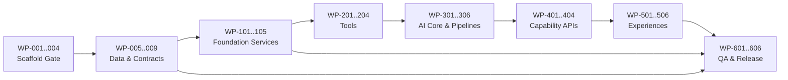

# 5. AI Engineering Planning

## 1. Planning Overview

### 1.1 Mục tiêu và phạm vi

Chuyển bộ normalized specs Phase 4.5 thành kế hoạch kỹ thuật có thể giao cho 4 AI coding agents trong 48 giờ, theo mô hình monorepo và scaffold-first. Kế hoạch bao phủ đầy đủ PC-01 Information Assistance, PC-02 Emergency Safety, PC-03 Appointment Booking, PC-04 Appointment Status, Content Management, Analytics và hai kênh chat.

Phase này chỉ lập kế hoạch. Không tạo code sản phẩm, database schema, SQL, infrastructure hoặc thay đổi contract.

### 1.2 Nguồn đầu vào bắt buộc

- Registries: `docs/spec-registry/artifact-index.yaml`, `capability-map.yaml`, `contract-map.yaml`, `component-map.yaml`, `tool-map.yaml`, `reference-pack-index.yaml`.
- Capability packs: bốn file trong `docs/reference-packs/capabilities/`.
- Raw data: `data/mvp/manifest.json`, sáu seed JSON và `data/mvp/tests/mvp-test-cases.json`.
- Canonical RAG corpus được tập trung tại `docs/knowledge/`: bảng giá, quy trình đón tiếp và bảy tài liệu BHYT trong `docs/knowledge/bhyt/`, gồm `bieugia_bhyt.md`.
- `docs/knowledge/spec-normalization-plan.md` và metadata frontmatter không phải RAG content; WP-007 dùng source allowlist trong manifest/seed registry làm căn cứ ingest.

### 1.3 Giả định lập kế hoạch

- Data pack có trạng thái `ready_for_schema_mapping`; RAG documents đã đủ để thực hiện source registration, ingestion và retrieval testing.
- Supabase/LLM/embedding credentials đã có nhưng chỉ được cấp qua environment/secret manager khi triển khai.
- Toàn bộ dữ liệu bootstrap ban đầu, bao gồm bảy tài liệu BHYT, mặc định `approved_for_pilot` theo quyết định Product Owner. Approval này chỉ áp dụng MVP Pilot, không thay thế phê duyệt production.
- `data/mvp/manifest.json` và `data/mvp/seed/knowledge-base.json` là source registry canonical của bootstrap; WP-007 xác minh metadata/path và áp dụng default metadata cho bootstrap file thiếu frontmatter.
- `ALL_CAPABILITIES` là alias truy vết tới PC-01, PC-02, PC-03, PC-04 cho các task nền tảng.
- WP-001 là root duy nhất có dependency rỗng. Mọi work package còn lại có dependency tường minh.
- Module database được định danh đầu tiên theo Data Foundation First; execution vẫn bắt đầu bằng scaffold gate vì không builder task nào được chạy trước WP-003.

### 1.4 Triết lý thực thi

DAG bắt buộc: Scaffold Gate → Database/Seed/Contracts → Foundation APIs → Tools → AI → Capability APIs → Frontend → QA/Release. Parallelism chỉ diễn ra trong cùng wave khi toàn bộ dependency của work package đã đạt acceptance criteria.

### 1.5 Capability-to-Execution Summary

| Capability | Layers | Modules | Work packages chính |
|---|---|---|---|
| PC-01 Information Assistance | L0–L6 | M1.2, M2.1, M3.3, M4.1, M5.2, M5.5, M6.2 | WP-102, WP-201, WP-303, WP-401, WP-502, WP-505, WP-602 |
| PC-02 Emergency Safety | L0–L6 | M1.3, M2.2, M3.4, M4.2, M5.4, M6.3 | WP-103, WP-202, WP-304, WP-402, WP-504, WP-603 |
| PC-03 Appointment Booking | L0–L6 | M1.4, M2.3, M3.5, M4.3, M5.3, M6.4 | WP-104, WP-203, WP-305, WP-403, WP-503, WP-604 |
| PC-04 Appointment Status | L0–L6 | M1.4, M2.3, M3.6, M4.4, M5.3, M6.4 | WP-104, WP-203, WP-306, WP-404, WP-503, WP-604 |
| Cross-cutting | L0–L6 | Foundation/shared/logging/release modules | Các WP mang alias ALL_CAPABILITIES |

## 2. Layers

| ID | Layer | Purpose / trách nhiệm | Dependency |
|---|---|---|---|
| L0 | Data & Delivery Foundation | Schema, seed/ingestion, scaffold gate và shared contracts. | Không có dependency layer; mọi builder task phụ thuộc scaffold verification. |
| L1 | Foundation Services | API truy xuất/lưu trữ nhanh, rẻ, không reasoning. | L0 |
| L2 | Tool Layer | Tool adapters chuẩn hóa truy cập Foundation services. | L1 |
| L3 | AI Capability Core | Provider abstraction, orchestration, guardrails và bốn capability pipelines. | L2 |
| L4 | Capability API Layer | Bốn primary Capability APIs dùng bởi frontend. | L3 và L1 |
| L5 | Experience Layer | Widget, standalone chat và admin dashboard. | L4 và các Foundation APIs quản trị |
| L6 | Quality & Release | Contract, integration, E2E, safety, NFR và release gate. | L0–L5 |

## 3. Modules

| Module | Layer | Name | Purpose | Capability | Work packages |
|---|---|---|---|---|---|
| M0.0 | L0 | Database Schema Foundation | Mô hình lưu trữ Supabase, migration, RLS và retention | ALL_CAPABILITIES | WP-005, WP-006 |
| M0.1 | L0 | Knowledge Source & Data Ingestion | Kiểm kê `docs/knowledge`, source-level approval/allowlist, document-aware bounded chunking, import và RAG indexing | ALL_CAPABILITIES | WP-007, WP-008 |
| M0.2 | L0 | Workspace Bootstrap & Verification | Manifest, scaffold, verification gate, placeholder/region | ALL_CAPABILITIES | WP-001–WP-004 |
| M0.3 | L0 | Shared Contracts & Runtime Configuration | DTO/error/config dùng chung | ALL_CAPABILITIES | WP-009 |
| M1.1 | L1 | Session, Config & Feedback | Foundation APIs dùng chung | ALL_CAPABILITIES | WP-101 |
| M1.2 | L1 | Knowledge & Content | Vector + PostgreSQL FTS retrieval, RRF fusion, content workflow và conflict | PC-01 | WP-102 |
| M1.3 | L1 | Emergency Foundation | Protocol, keyword, event | PC-02 | WP-103 |
| M1.4 | L1 | Appointment & Mock HIS | Khoa, bác sĩ, slot, create, lookup | PC-03, PC-04 | WP-104 |
| M1.5 | L1 | Logging & Analytics | Conversation, audit, analytics | ALL_CAPABILITIES | WP-105 |
| M2.1 | L2 | Knowledge Tools | Rerank fused candidates, grounded search tool và fallback | PC-01 | WP-201 |
| M2.2 | L2 | Emergency Tools | Pre-filter và trigger | PC-02 | WP-202 |
| M2.3 | L2 | Appointment Tools | Booking và lookup tools | PC-03, PC-04 | WP-203 |
| M2.4 | L2 | Privacy & Logging Tools | PII và conversation logging | ALL_CAPABILITIES | WP-204 |
| M3.1 | L3 | AI Provider Abstraction | Native tool-calling adapters; OpenAI default with environment-selected provider/model | ALL_CAPABILITIES | WP-301 |
| M3.2 | L3 | LangGraph Agent Core | Bounded graph state, dynamic tools, policy gates, checkpoint/interrupt, guardrails and grounding | ALL_CAPABILITIES | WP-302 |
| M3.3 | L3 | Information Assistance AI | PC-01 pipeline | PC-01 | WP-303 |
| M3.4 | L3 | Emergency Safety AI | PC-02 pipeline | PC-02 | WP-304 |
| M3.5 | L3 | Appointment Booking AI | PC-03 pipeline | PC-03 | WP-305 |
| M3.6 | L3 | Appointment Status AI | PC-04 pipeline | PC-04 | WP-306 |
| M4.1 | L4 | Information Assistance API | Primary Capability API | PC-01 | WP-401 |
| M4.2 | L4 | Emergency Safety API | Primary Capability API | PC-02 | WP-402 |
| M4.3 | L4 | Appointment Booking API | Primary Capability API | PC-03 | WP-403 |
| M4.4 | L4 | Appointment Status API | Primary Capability API | PC-04 | WP-404 |
| M5.1 | L5 | Shared Chat Channels | Client, widget, standalone | ALL_CAPABILITIES | WP-501 |
| M5.2 | L5 | Information UI | Response/citation/actions | PC-01 | WP-502 |
| M5.3 | L5 | Appointment UI | Booking/status | PC-03, PC-04 | WP-503 |
| M5.4 | L5 | Emergency UI | Banner/contact handoff | PC-02 | WP-504 |
| M5.5 | L5 | Content Dashboard | Workflow/conflict | PC-01 | WP-505 |
| M5.6 | L5 | Analytics Dashboard | Analytics/audit | ALL_CAPABILITIES | WP-506 |
| M6.1 | L6 | Contract & Data QA | Contract/data validation | ALL_CAPABILITIES | WP-601 |
| M6.2 | L6 | Information QA | PC-01 integration/E2E | PC-01 | WP-602 |
| M6.3 | L6 | Emergency QA | Safety/resilience/E2E | PC-02 | WP-603 |
| M6.4 | L6 | Appointment QA | PC-03/04 integration/E2E | PC-03, PC-04 | WP-604 |
| M6.5 | L6 | Admin QA | Content/analytics/E2E | ALL_CAPABILITIES | WP-605 |
| M6.6 | L6 | Release Gate | NFR/security/performance/VPS | ALL_CAPABILITIES | WP-606 |

Mỗi module dùng artifact và contract được khai báo cụ thể trong work-package registry/packs. Không module nào được dùng để thiết kế lại contract Phase 4.5.

### 3.1 Artifact và contract dependency theo module

| Module | Related artifacts | Related contracts |
|---|---|---|
| M0.2 | ARCH-03, INT-09, ARCH-09 | Không có named contract; dùng constraints trong artifacts |
| M0.0 | ARCH-02, ARCH-08, INT-04, INT-09, ARCH-09, INT-07 | SessionDTO, KnowledgeChunkDTO, AppointmentDTO, EmergencyEventReceiptDTO, UnifiedErrorEnvelope, RetryPolicy |
| M0.1 | ARCH-02, ARCH-08, INT-04, ARCH-09 | EmergencyKeywordSetDTO, EmergencyProtocolDTO, AppointmentDTO, AnalyticsSummaryDTO, KnowledgeChunkDTO, ContentVersionDTO |
| M0.3 | INT-04, INT-07, INT-09 | CapabilityResponseEnvelope, UnifiedErrorEnvelope, ClientContextDTO, ChannelConfigurationDTO, ChatConfigurationDTO |
| M1.1 | INT-03, INT-04, INT-07 | FND-SES-01 CreateSession, FND-SES-02 GetSessionContext, FND-SES-03 PatchSessionContext, FND-CFG-01 GetChannels, FND-CFG-02 GetChatConfiguration, FND-FBK-01 CreateFeedback |
| M1.2 | ARCH-08, INT-03, INT-04 | FND-KNW-01 SearchKnowledge, FND-KNW-02 GetKnowledgeChunk, FND-KNW-03 CreateContentDraft, FND-KNW-08 ListContentConflicts, FND-KNW-09 ResolveContentConflict, ContentConflictDTO |
| M1.3 | ARCH-01, ARCH-09, INT-03, INT-04 | FND-EMG-01 GetEmergencyProtocol, FND-EMG-02 GetEmergencyKeywordSet, FND-EMG-03 CreateEmergencyEvent, EmergencyProtocolDTO |
| M1.4 | ARCH-03, ARCH-08, INT-03, INT-04 | FND-APT-01 ListSpecialties, FND-APT-02 ListDoctors, FND-APT-03 ListAvailableSlots, FND-APT-04 CreateAppointment, FND-APT-05 GetAppointment, AppointmentDTO |
| M1.5 | ARCH-08, INT-03, INT-04 | FND-HIS-01 GetConversationHistory, FND-ANA-01 GetAnalyticsSummary, ConversationHistoryPageDTO, AnalyticsSummaryDTO |
| M2.1 | ARCH-06, INT-06, INT-07 | search_knowledge_base, fallback_response, KnowledgeSearchResponse |
| M2.2 | ARCH-06, ARCH-09, INT-06 | trigger_emergency, PreFilterResultDTO, EmergencyEventReceiptDTO |
| M2.3 | ARCH-06, INT-06, INT-07 | get_specialty_list, get_doctor_list, get_available_slots, create_appointment_draft, submit_appointment_request, get_patient_appointments, get_appointment_request_status |
| M2.4 | ARCH-06, INT-06, INT-07 | detect_pii, log_conversation |
| M3.1 | ARCH-03, ARCH-09, INT-05 | AIInputContract, AIOutputContract, UnifiedErrorEnvelope |
| M3.2 | ARCH-05, ARCH-07, INT-05, INT-07 | AgentDecisionDTO, ToolPolicyDecisionDTO, ObservationResultDTO, ConversationResultDTO, ExplainabilityResultDTO, GroundingFallbackBehavior |
| M3.3 | ARCH-04, ARCH-05, INT-05 | InformationAssistanceRequest, InformationAssistanceResponse, CitationDTO |
| M3.4 | ARCH-04, ARCH-05, ARCH-09, INT-05 | EmergencySafetyRequest, EmergencySafetyResponse, EmergencyProtocolDTO |
| M3.5 | ARCH-04, ARCH-05, INT-05 | AppointmentBookingRequest, AppointmentBookingResponse, BookingFlowStateDTO, PatientAppointmentDataDTO |
| M3.6 | ARCH-04, ARCH-05, INT-05 | AppointmentStatusRequest, AppointmentStatusResponse, AppointmentDTO |
| M4.1 | INT-02, INT-08, INT-09 | InformationAssistanceAPI, InformationAssistanceRequest, InformationAssistanceResponse, CapabilityResponseEnvelope |
| M4.2 | INT-02, INT-08, INT-09 | EmergencySafetyAPI, EmergencySafetyRequest, EmergencySafetyResponse, CapabilityResponseEnvelope |
| M4.3 | INT-02, INT-08, INT-09 | AppointmentBookingAPI, AppointmentBookingRequest, AppointmentBookingResponse, CapabilityResponseEnvelope |
| M4.4 | INT-02, INT-08, INT-09 | AppointmentStatusAPI, AppointmentStatusRequest, AppointmentStatusResponse, CapabilityResponseEnvelope |
| M5.1 | ARCH-03, INT-02, INT-09 | CapabilityResponseEnvelope, ClientContextDTO, ChannelConfigurationDTO |
| M5.2 | INT-02, INT-04, INT-09 | InformationAssistanceResponse, CitationDTO, SuggestedActionDTO, ExplainabilityDTO |
| M5.3 | INT-02, INT-04, INT-08 | AppointmentBookingResponse, AppointmentStatusResponse, BookingFlowStateDTO, AppointmentDTO |
| M5.4 | ARCH-09, INT-02, INT-04 | EmergencySafetyResponse, SuggestedActionDTO |
| M5.5 | ARCH-03, INT-03, INT-04 | ContentDraftDTO, ContentConflictPageDTO, ContentConflictResolveRequest |
| M5.6 | ARCH-03, INT-03, INT-04 | AnalyticsSummaryDTO, ConversationHistoryPageDTO, PageMetadataDTO |
| M6.1 | INT-03, INT-04, INT-07, INT-09 | UnifiedErrorEnvelope, RetryPolicy, FallbackPolicy |
| M6.2 | ARCH-04, INT-08 | InformationAssistanceAPI, KnowledgeSearchResponse, GroundingFallbackBehavior |
| M6.3 | ARCH-09, INT-08 | EmergencySafetyAPI, PreFilterResultDTO, EmergencyProtocolDTO |
| M6.4 | ARCH-04, INT-08 | AppointmentBookingAPI, AppointmentStatusAPI, AppointmentDTO |
| M6.5 | INT-03, INT-08, INT-09 | ContentConflictDTO, AnalyticsSummaryDTO, ConversationHistoryPageDTO |
| M6.6 | ARCH-01, ARCH-09, INT-07, INT-09 | RetryPolicy, FallbackPolicy, UnifiedErrorEnvelope |

## 4. Work Packages

| ID | Title | Layer/Module | Capability | Pool | Size | Dependencies |
|---|---|---|---|---|---|---|
| WP-001 | Bootstrap manifests creation | L0/M0.2 | ALL_CAPABILITIES | OTHER | S | ROOT |
| WP-002 | Scaffold bootstrap script planning | L0/M0.2 | ALL_CAPABILITIES | OTHER | M | WP-001 |
| WP-003 | Scaffold verification gate | L0/M0.2 | ALL_CAPABILITIES | QA | M | WP-002 |
| WP-004 | Placeholder and region initialization | L0/M0.2 | ALL_CAPABILITIES | OTHER | S | WP-003 |
| WP-005 | Supabase schema and migration foundation | L0/M0.0 | ALL_CAPABILITIES | DATA | L | WP-003 |
| WP-006 | Database connectivity, RLS and retention controls | L0/M0.0 | ALL_CAPABILITIES | DATA | M | WP-005 |
| WP-007 | Knowledge source registry and seed schema mapping | L0/M0.1 | ALL_CAPABILITIES | DATA | M | WP-003 |
| WP-008 | Seed import and RAG knowledge ingestion/indexing | L0/M0.1 | ALL_CAPABILITIES | DATA | L | WP-006, WP-007 |
| WP-009 | Shared DTO, error and runtime configuration contracts | L0/M0.3 | ALL_CAPABILITIES | API | M | WP-003 |
| WP-101 | Session, configuration and feedback foundation services | L1/M1.1 | ALL_CAPABILITIES | API | M | WP-006, WP-009 |
| WP-102 | Knowledge, content workflow and conflict services | L1/M1.2 | PC-01 | API | L | WP-008, WP-009 |
| WP-103 | Emergency protocol and event foundation services | L1/M1.3 | PC-02 | API | M | WP-008, WP-009 |
| WP-104 | Appointment foundation and Mock HIS services | L1/M1.4 | PC-03,PC-04 | API | L | WP-008, WP-009 |
| WP-105 | Conversation, analytics and audit foundation services | L1/M1.5 | ALL_CAPABILITIES | API | M | WP-006, WP-009 |
| WP-201 | Knowledge search and fallback tools | L2/M2.1 | PC-01 | AI-CORE | M | WP-102, WP-009 |
| WP-202 | Emergency trigger and pre-filter tool | L2/M2.2 | PC-02 | AI-CORE | M | WP-103, WP-009 |
| WP-203 | Appointment tools | L2/M2.3 | PC-03,PC-04 | API | M | WP-104, WP-009 |
| WP-204 | PII detection and conversation logging tools | L2/M2.4 | ALL_CAPABILITIES | AI-CORE | M | WP-105, WP-009 |
| WP-301 | Native tool-calling provider abstraction with OpenAI default | L3/M3.1 | ALL_CAPABILITIES | AI-CORE | M | WP-201, WP-202, WP-203, WP-204 |
| WP-302 | LangGraph bounded agent, policy, persistence and guardrail core | L3/M3.2 | ALL_CAPABILITIES | AI-CORE | L | WP-301, WP-201, WP-202, WP-203, WP-204 |
| WP-303 | Information assistance AI pipeline | L3/M3.3 | PC-01 | AI-CORE | M | WP-302, WP-201 |
| WP-304 | Emergency safety AI pipeline | L3/M3.4 | PC-02 | AI-CORE | M | WP-302, WP-202 |
| WP-305 | Appointment booking AI pipeline | L3/M3.5 | PC-03 | AI-CORE | M | WP-302, WP-203 |
| WP-306 | Appointment status AI pipeline | L3/M3.6 | PC-04 | AI-CORE | S | WP-302, WP-203 |
| WP-401 | Information Assistance Capability API | L4/M4.1 | PC-01 | API | M | WP-303, WP-101, WP-102, WP-105 |
| WP-402 | Emergency Safety Capability API | L4/M4.2 | PC-02 | API | M | WP-304, WP-101, WP-103, WP-105 |
| WP-403 | Appointment Booking Capability API | L4/M4.3 | PC-03 | API | M | WP-305, WP-101, WP-104, WP-105 |
| WP-404 | Appointment Status Capability API | L4/M4.4 | PC-04 | API | S | WP-306, WP-101, WP-104, WP-105 |
| WP-501 | Shared chat client, SSE and channel shells | L5/M5.1 | ALL_CAPABILITIES | FE | L | WP-401, WP-402, WP-403, WP-404 |
| WP-502 | Information response, citation and actions UI | L5/M5.2 | PC-01 | FE | M | WP-501, WP-401 |
| WP-503 | Appointment booking and status UI | L5/M5.3 | PC-03,PC-04 | FE | M | WP-501, WP-403, WP-404 |
| WP-504 | Emergency banner and contact handoff UI | L5/M5.4 | PC-02 | FE | M | WP-501, WP-402 |
| WP-505 | Admin content and conflict dashboard | L5/M5.5 | PC-01 | FE | L | WP-501, WP-102, WP-101 |
| WP-506 | Admin analytics and audit dashboard | L5/M5.6 | ALL_CAPABILITIES | FE | M | WP-501, WP-105 |
| WP-601 | Contract and data validation suite | L6/M6.1 | ALL_CAPABILITIES | QA | M | WP-008, WP-009, WP-101, WP-102, WP-103, WP-104, WP-105 |
| WP-602 | Information Assistance integration and E2E QA | L6/M6.2 | PC-01 | QA | M | WP-401, WP-502, WP-601 |
| WP-603 | Emergency safety and resilience QA | L6/M6.3 | PC-02 | QA | L | WP-402, WP-504, WP-601 |
| WP-604 | Appointment booking and status QA | L6/M6.4 | PC-03,PC-04 | QA | M | WP-403, WP-404, WP-503, WP-601 |
| WP-605 | Admin content and analytics QA | L6/M6.5 | ALL_CAPABILITIES | QA | M | WP-505, WP-506, WP-601 |
| WP-606 | NFR, security, performance and VPS release gate | L6/M6.6 | ALL_CAPABILITIES | QA | L | WP-602, WP-603, WP-604, WP-605 |

Chi tiết purpose, artifact, contract, expected output và acceptance criteria canonical nằm tại `docs/spec-registry/work-package-map.yaml`; execution context nằm trong từng file `docs/reference-packs/work-packages/*.pack.md`.

## 5. Dependency Graph

### 5.1 Blockers

- WP-003 chưa pass: không builder-facing work package nào được bắt đầu.
- WP-005/006 chưa xong: không nạp seed hoặc chạy Foundation services.
- WP-007 chưa xong: source registry/bootstrap metadata phải được kiểm chứng trước khi dùng làm source catalog canonical.
- WP-008 chưa xong: knowledge/emergency/appointment services chưa có canonical data và runtime RAG index.
- WP-201–204 chưa xong: AI implementation chưa bắt đầu.
- WP-601 chưa pass: không bắt đầu capability E2E.
- Emergency/contact placeholder chưa được thay hoặc sign-off: WP-606 không được cấp go-live cho người dùng thật.

### 5.2 Vùng có thể song song

- Sau WP-003: WP-005, WP-007 và WP-009 có thể chạy song song; WP-004 là nhánh scaffold độc lập nhưng phải hoàn tất trước task ghi vào region tương ứng.
- Sau WP-008/009: WP-101–105 có thể chia cho tối đa bốn agents theo component ownership.
- Tool, capability pipeline, API và UI có thể song song theo bốn lane capability sau khi upstream tương ứng hoàn tất.
- QA PC-01, PC-02, appointment và admin có thể chạy song song sau WP-601.

## 6. Execution Waves

| Wave | Work packages | Goal | Entry condition | Exit condition |
|---|---|---|---|---|
| 0 — Scaffold Gate | WP-001–WP-004 | Chuẩn hóa manifest, scaffold, verification, regions | Repo và normalized specs khả dụng | WP-003 pass; placeholder/region cần thiết đã sẵn sàng |
| 1 — Data & Contracts | WP-005–WP-009 | Schema, security, source registration, import/RAG index, shared contracts | Wave 0 pass | DB sạch migrate được; source catalog reconciled; seed/RAG dry-run, import/index và shared contracts pass |
| 2 — Foundation Services | WP-101–WP-105 | Hoàn tất API không reasoning | Wave 1 pass | Foundation contract tests pass |
| 3 — Tools | WP-201–WP-204 | Chuẩn hóa tool adapters | Foundation dependency tương ứng pass | Tool contract, timeout, retry/fallback tests pass |
| 4 — AI | WP-301–WP-306 | OpenAI-default provider abstraction, LangGraph bounded agent, guardrails và capability profiles | Toàn bộ tools pass | Tool selection, interrupt/resume, checkpoint, policy, safety và grounding tests pass |
| 5 — Capability APIs | WP-401–WP-404 | Expose bốn primary APIs | Pipeline + foundation dependency pass | Capability API contract tests pass |
| 6 — Experiences | WP-501–WP-506 | Hai chat channels và dashboard chung | Bốn Capability APIs pass | UI component/integration checks pass |
| 7 — QA & Release | WP-601–WP-606 | E2E, safety, NFR và go/no-go | Các upstream theo registry pass | WP-606 phát hành báo cáo go/no-go |

### 6.1 Phân bổ 4 agents trong 48 giờ

- Agent DATA/OTHER: Wave 0–1, sau đó hỗ trợ contract/data QA.
- Agent API: Foundation services → Capability APIs.
- Agent AI-CORE: Tools → orchestration → capability pipelines.
- Agent FE/QA: chuẩn bị test harness theo packs, sau API thì triển khai experiences và E2E.

Pool là ownership logic, không phải khóa cứng con người. Khi đổi agent, bắt buộc đọc work-package pack và xác nhận upstream evidence. Timeline 48 giờ chỉ khả thi cho MVP demo nếu dùng parallel lanes, scope không tăng và Wave 0–1 hoàn tất sớm.

## 7. Validation Strategy

### 7.1 Theo layer

| Layer | Validation bắt buộc |
|---|---|
| L0 | Manifest/scaffold checks; migration clean-run; RLS/secret tests; source allowlist/approval; bounded document-aware chunks; metadata/provenance; 768-d embedding shape; dry-run, transaction và idempotency checks |
| L1 | Foundation API contract, validation, authorization, pagination/filtering; xác nhận không gọi LLM |
| L2 | Tool input/output schema, timeout, retry, fallback, idempotency và fault injection |
| L3 | Native tool selection without intent routing; LangGraph checkpoint/interrupt/resume; policy denial; execution budget; grounding, citation, prompt-injection/PII, emergency deterministic path and provider outage |
| L4 | Capability contract, auth/rate limit/versioning, streaming parity, unified errors |
| L5 | Component, accessibility-critical states, two-channel parity, dashboard authorization và no-PII display |
| L6 | Cross-layer integration, E2E từ data đến UI, NFR, security, resilience và VPS release evidence |

### 7.2 Review intensity

- Size S: một reviewer, automated checks và contract spot-check.
- Size M: một reviewer độc lập, unit/contract suite, negative cases.
- Size L: reviewer lead + domain reviewer liên quan, integration/fault tests và evidence bắt buộc.
- WP-603 và WP-606 luôn dùng mức review L; emergency mock không được hiểu là clinical approval.

### 7.3 Integration checkpoints

- CP0: WP-003 scaffold gate.
- CP1: WP-006 + WP-008 + WP-009 data/contracts baseline.
- CP2: WP-101–105 Foundation services contract baseline.
- CP3: WP-201–204 tool registry baseline.
- CP4: WP-303–306 AI behavior baseline.
- CP5: WP-401–404 API baseline.
- CP6: WP-501–506 experience baseline.
- CP7: WP-606 release decision.

Test cases trong `data/mvp/tests/mvp-test-cases.json` là raw test input; builder phải ánh xạ chúng vào work package QA tương ứng, không được coi file seed tự thân là bằng chứng pass.

## 8. Risks and Notes

- 48 giờ là lịch aggressive; đường critical WP-001 → WP-003 → WP-005 → WP-006 → WP-008 → Foundation → Tools → AI → API → FE → QA không có nhiều buffer.
- Phase 4.5 không chứa database schema cụ thể; WP-005 phải hiện thực từ domain/data contracts nhưng không được đổi semantics của các contract.
- Bộ BHYT gồm bảy tài liệu, trong đó có biểu giá, đã `approved_for_pilot` để ingestion, retrieval và test MVP. Câu trả lời vẫn phải có citation, disclaimer và không xác định quyền lợi/số tiền cuối cùng theo hồ sơ cá nhân.
- `docs/knowledge/spec-normalization-plan.md` và metadata frontmatter không được chunk như nội dung trả lời; source registry là căn cứ truy vết provenance.
- Emergency protocol/keywords, hotline, địa chỉ và URL đang mock. Chỉ được demo có cảnh báo hoặc phải thay/sign-off trước release gate.
- Production retention/rate-limit và HIS thật vẫn ngoài scope MVP; không được biến giả định pilot thành quyết định production.
- Live-agent mức 1 chỉ là contact handoff; không lập real-time agent routing/API.
- Supabase credentials chỉ cần ở Wave 1 sau khi migration, mapping và dry-run đã sẵn sàng; tuyệt đối không ghi vào repo.
