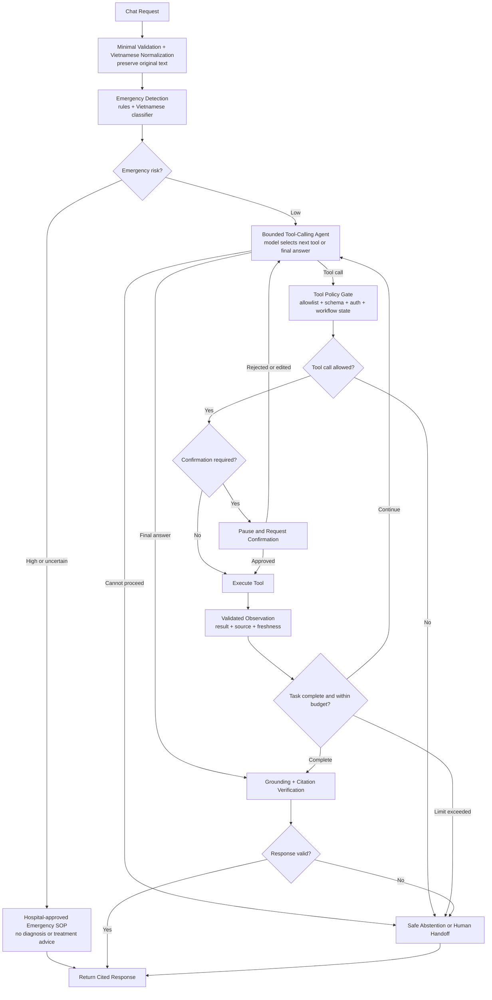
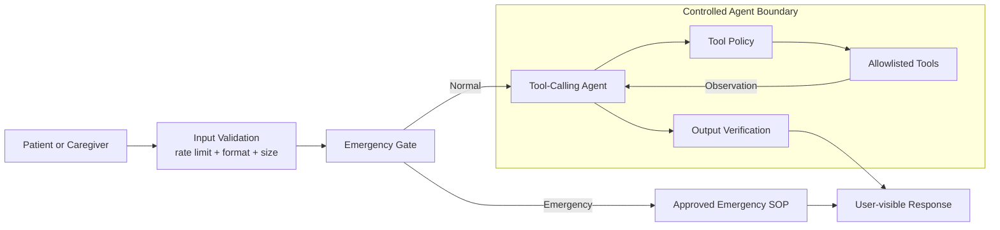
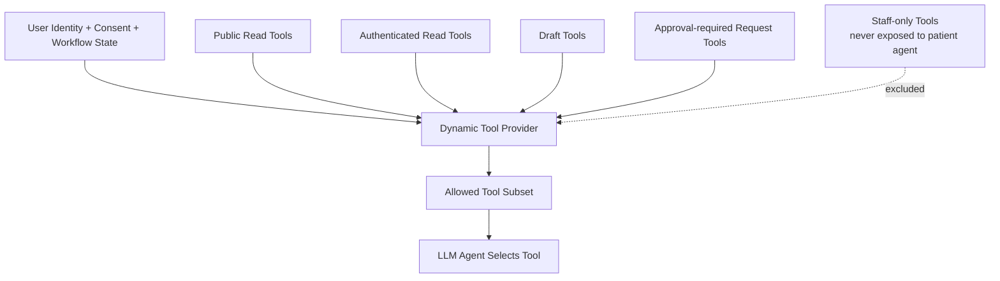
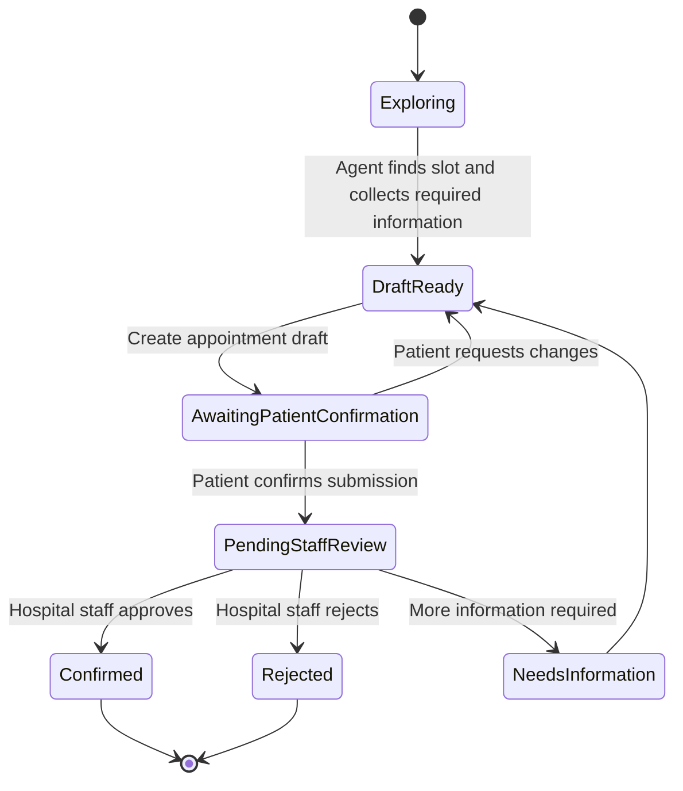
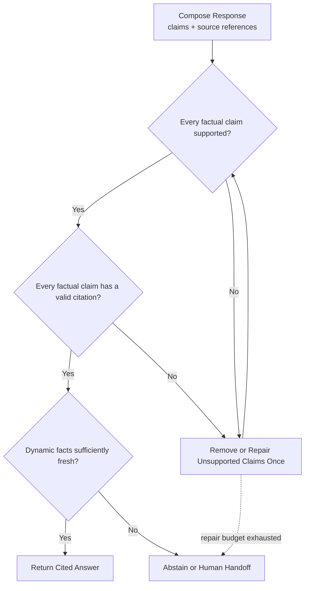

# Hospital AI Navigation Architecture — Improved Agent Flow

## 1. Design principles

- Emergency detection runs before normal agent processing.
- The system does not require an intent router before the agent.
- The LLM agent selects tools using native tool calling.
- The backend controls which tools are visible based on authorization and workflow state.
- Every tool call passes through an allowlist, schema validation, and policy checks.
- Read operations may execute automatically; write operations require confirmation or staff approval.
- Tool observations return to the agent, allowing a bounded ReAct loop.
- Factual responses must be grounded in approved evidence and include valid citations.
- If the system lacks sufficient evidence or exhausts its execution budget, it abstains or hands off to hospital staff.

## 2. Simplified bounded agent flow



## 3. Security boundary

Security is applied throughout the system instead of being represented as a single blocking step before emergency detection.



Security controls include:

- Before the agent: request-size limits, Unicode validation, rate limiting, and lightweight Vietnamese normalization.
- During model calls: prompt separation, minimized patient data, and no credentials or secrets in model context.
- Before tool execution: tool allowlist, argument-schema validation, authentication, authorization, workflow-state checks, and approval gates.
- After execution: PII filtering, source and freshness validation, grounding checks, and citation completeness.

Emergency handling takes priority even if a message also resembles a prompt-injection attempt.

## 4. Tool availability model

The system does not select tool groups by intent. The agent determines which tool is useful, while the backend limits tool visibility using user permissions and workflow state.



The effective tool set is:

```text
Visible tools
    = tools allowed for the current workflow state
    ∩ tools authorized for the current user
    ∩ tools allowed by system policy
```

### Public read tools

```text
search_official_knowledge
get_locations
get_departments
get_doctors
get_services
get_working_hours
get_service_prices
get_available_slots
```

### Authenticated patient tools

```text
get_patient_appointments
get_appointment_request_status
```

### Draft tools

```text
create_appointment_draft
```

### Approval-required request tools

```text
submit_appointment_request
request_reschedule
request_cancellation
```

### Staff-only operations

The patient-facing agent must never receive these tools:

```text
confirm_appointment
reject_appointment
update_medical_record
change_service_price
```

## 5. Booking workflow with human approval



The following states are distinct:

```text
Appointment draft
    != Appointment request
    != Confirmed appointment
```

The agent may create a draft. It may submit a request only after patient confirmation. The official appointment is confirmed only by authorized hospital staff.

## 6. Bounded execution controls

Each agent run should have explicit limits:

```json
{
  "max_tool_calls": 6,
  "max_repairs": 1,
  "deadline_ms": 12000,
  "tool_calls_used": 0,
  "visited_calls": []
}
```

Required runtime rules:

- Do not repeat the same tool with identical arguments unless the underlying state changed.
- Do not allow the model to unlock additional write permissions.
- Reject tools that are absent from the current allowlist.
- Stop when the tool-call budget or deadline is exhausted.
- Require an idempotency key for every write operation.
- Validate every dynamic result for source, retrieval time, and freshness.
- Audit tool name, validated arguments, authorization outcome, result status, and approval decision.
- Never store hidden chain-of-thought; store tool calls, observations, state transitions, and final decisions instead.

## 7. Grounded response validation



Static hospital information must come from approved, versioned knowledge. Dynamic information such as schedules, slots, appointment states, and current prices should come from authoritative hospital APIs whenever available.

## 8. Orchestration technology and provider defaults

- LangGraph is the orchestration runtime for graph state, conditional routing, durable execution, streaming, and human-in-the-loop interrupts.
- The graph does not contain an intent-router node. The model selects the next tool through native tool calling from the backend-provided visible tool subset.
- Emergency detection, authorization, tool policy, schema validation, confirmation, grounding, and audit remain application-controlled graph nodes.
- PostgreSQL-backed LangGraph checkpoints are used outside tests; in-memory checkpoints are test-only.
- OpenAI is the default LLM provider. Provider and model are runtime settings, not capability/API contracts.

```text
LLM_PROVIDER=openai
LLM_MODEL=gpt-5-mini
OPENAI_API_KEY=<server-side secret>
```

Changing `LLM_PROVIDER` or `LLM_MODEL` must not change tool schemas, graph state contracts, safety behavior, or capability response envelopes. Unsupported providers/models fail configuration validation at startup. Provider failure follows the configured fallback policy; no provider failure may bypass the local emergency path or grounding requirements.
